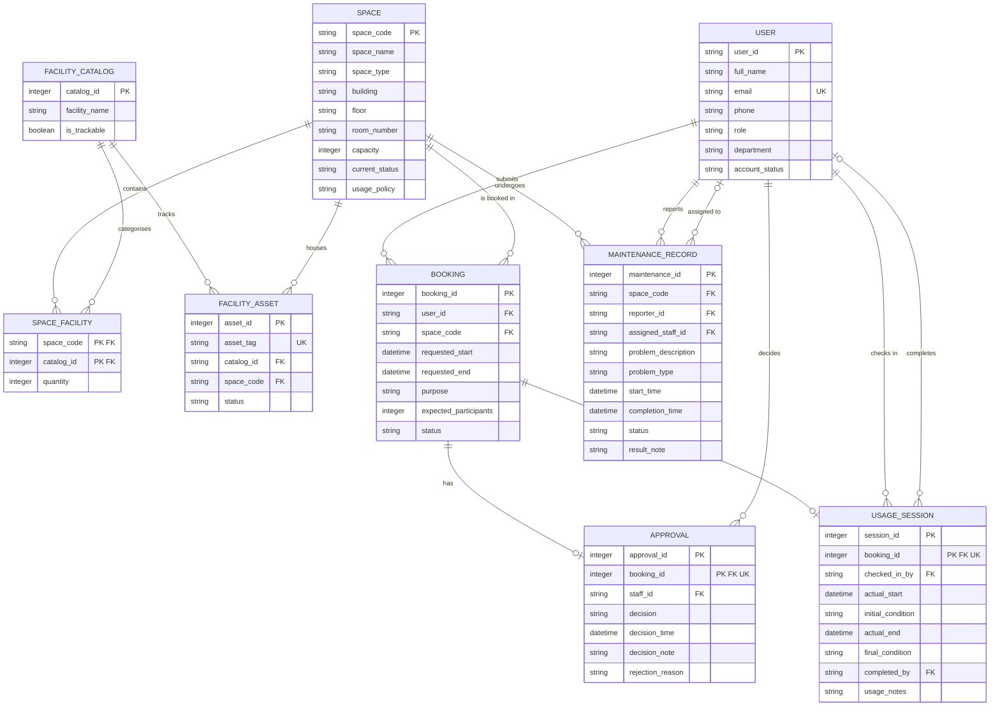

# Conceptual ERD Design — G11

## Entities Verified from Step 1

1. USER
2. SPACE
3. FACILITY_CATALOG
4. SPACE_FACILITY (Associative Entity)
5. FACILITY_ASSET
6. BOOKING
7. APPROVAL
8. USAGE_SESSION
9. MAINTENANCE_RECORD

## Relationships Verified from Step 1

| Left Entity | Relationship | Right Entity | Left Card. | Right Card. |
|-------------|-------------|-------------|-----------|------------|
| USER | submits | BOOKING | Exactly 1 | Zero or Many |
| SPACE | is booked in | BOOKING | Exactly 1 | Zero or Many |
| SPACE | contains (via) | SPACE_FACILITY | Exactly 1 | Zero or Many |
| FACILITY_CATALOG | categorises (via) | SPACE_FACILITY | Exactly 1 | Zero or Many |
| FACILITY_CATALOG | tracks | FACILITY_ASSET | Exactly 1 | Zero or Many |
| SPACE | houses | FACILITY_ASSET | Exactly 1 | Zero or Many |
| BOOKING | has (strictly one) | APPROVAL | Exactly 1 | Zero or One |
| BOOKING | has (strictly one) | USAGE_SESSION | Exactly 1 | Zero or One |
| USER | decides | APPROVAL | Exactly 1 | Zero or Many |
| USER | checks in | USAGE_SESSION | Exactly 1 | Zero or Many |
| USER | completes | USAGE_SESSION | Zero or One | Zero or Many |
| SPACE | undergoes | MAINTENANCE_RECORD | Exactly 1 | Zero or Many |
| USER | reports | MAINTENANCE_RECORD | Exactly 1 | Zero or Many |
| USER | assigned to | MAINTENANCE_RECORD | Zero or One | Zero or Many |

## ERD — Mermaid `erDiagram`

## Participation Constraints Summary

| Entity | Min Participation | Max Participation | Notes |
|--------|------------------|-------------------|-------|
| BOOKING → APPROVAL | 0 | 1 | Approval is optional; UNIQUE enforces 1-to-1 |
| BOOKING → USAGE_SESSION | 0 | 1 | Created at check-in; UNIQUE enforces 1-to-1 |
| USAGE_SESSION → USER (completed_by) | 0 | 1 | Nullable until session completion |
| MAINTENANCE_RECORD → USER (assigned_staff) | 0 | 1 | Assignment is optional |
| All other FK relationships | 1 | 1 | Mandatory participation |

## Data Types (Conceptual)

- `string` — all text-based attributes
- `integer` — numeric identifiers, capacity, quantity
- `datetime` — timestamps for start/end times
- `boolean` — flag values (is_trackable)

## Assumptions and Gaps

- All entity names and relationships are derived strictly from Step 1.
- SPACE_FACILITY is modeled as an associative entity because it carries the `quantity` business attribute.
- The 1-to-1 enforcement for APPROVAL and USAGE_SESSION is indicated via the `UK` marker on `booking_id`.
- No additional entities or relationships beyond those listed in Step 1 were introduced.
