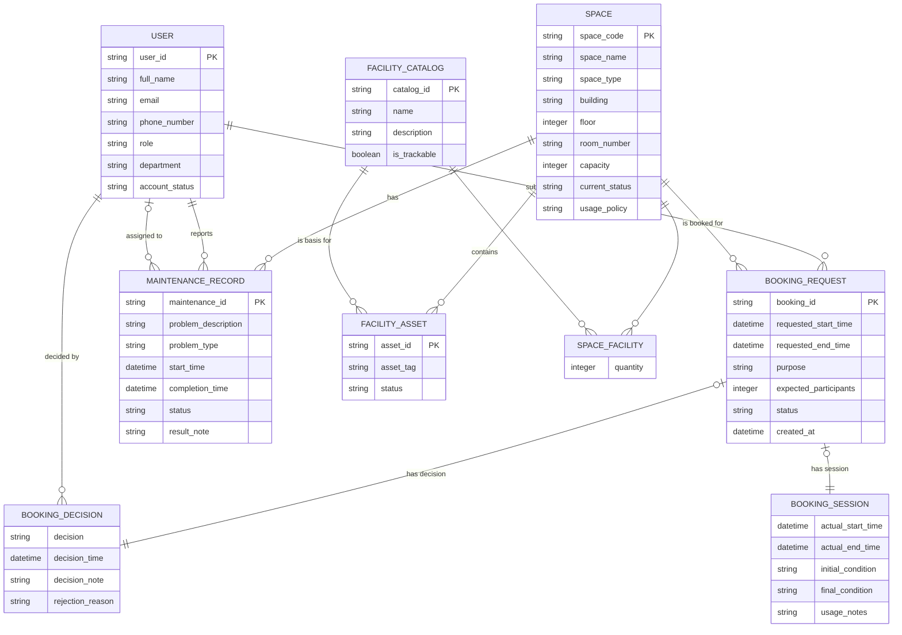

# Conceptual Entity-Relationship Design — G11

## 1. Entity List (from Step 1)

| # | Entity | Description |
|---|---|---|
| 1 | USER | University account holder (student, lecturer, TA, staff, admin, manager) |
| 2 | SPACE | A bookable physical space (classroom, lab, meeting room, auditorium) |
| 3 | FACILITY_CATALOG | Catalog of facility types with trackability flag |
| 4 | SPACE_FACILITY | Associative entity linking SPACE and FACILITY_CATALOG with quantity |
| 5 | FACILITY_ASSET | Individually trackable high-value assets |
| 6 | BOOKING_REQUEST | A request to use a space for a specific purpose and time |
| 7 | BOOKING_DECISION | Approval or rejection of a booking request |
| 8 | BOOKING_SESSION | Check-in and check-out record for a booking |
| 9 | MAINTENANCE_RECORD | Record of a maintenance problem for a space |

## 2. Relationships and Cardinalities

| Left Entity | Cardinality | Right Entity | Cardinality | Description |
|---|---|---|---|---|
| USER | 1 | submits | N | BOOKING_REQUEST |
| SPACE | 1 | is booked in | N | BOOKING_REQUEST |
| BOOKING_REQUEST | (0,1) | has | 1 | BOOKING_DECISION |
| BOOKING_REQUEST | (0,1) | has | 1 | BOOKING_SESSION |
| BOOKING_DECISION | N | is decided by | 1 | USER (staff) |
| SPACE | 1 | has | N | MAINTENANCE_RECORD |
| USER | 1 | reports | N | MAINTENANCE_RECORD |
| USER | (0,1) | is assigned to | N | MAINTENANCE_RECORD |
| SPACE | 1 | contains | N | FACILITY_ASSET |
| FACILITY_CATALOG | 1 | is basis for | N | FACILITY_ASSET |
| SPACE | M | categorized via | N | FACILITY_CATALOG (resolved by SPACE_FACILITY) |
| SPACE | 1 | linked to | N | SPACE_FACILITY |
| FACILITY_CATALOG | 1 | linked to | N | SPACE_FACILITY |

## 3. Conceptual Data Types

- **string**: All text-based attributes (user names, descriptions, codes, statuses, roles, types, policies, notes)
- **integer**: Numeric attributes (capacity, floor, quantity, expected_participants)
- **datetime**: Temporal attributes (start time, end time, creation time, decision time)
- **boolean**: Binary flag (is_trackable)

## 4. Mermaid ERD (Crow's Foot Notation)



## 5. Participation Constraints Summary

| Entity | Relationship | Min | Max |
|---|---|---|---|
| USER | submits BOOKING_REQUEST | 0 (may never submit) | N |
| BOOKING_REQUEST | submitted by USER | 1 (each request has a requester) | 1 |
| SPACE | is booked in BOOKING_REQUEST | 0 (may never be booked) | N |
| BOOKING_REQUEST | is for SPACE | 1 (each request is for a space) | 1 |
| BOOKING_REQUEST | has BOOKING_DECISION | 0 (pending requests) | 1 |
| BOOKING_DECISION | belongs to BOOKING_REQUEST | 1 | 1 |
| BOOKING_REQUEST | has BOOKING_SESSION | 0 (not yet checked in) | 1 |
| BOOKING_SESSION | belongs to BOOKING_REQUEST | 1 | 1 |
| BOOKING_DECISION | is decided by USER | 1 | 1 |
| USER | decides BOOKING_DECISION | 0 | N |
| SPACE | has MAINTENANCE_RECORD | 0 | N |
| MAINTENANCE_RECORD | belongs to SPACE | 1 | 1 |
| USER | reports MAINTENANCE_RECORD | 0 | N |
| MAINTENANCE_RECORD | reported by USER | 1 | 1 |
| USER | is assigned to MAINTENANCE_RECORD | 0 | N |
| MAINTENANCE_RECORD | assigned to USER | 0 | 1 |
| SPACE | contains FACILITY_ASSET | 0 | N |
| FACILITY_ASSET | located in SPACE | 1 | 1 |
| FACILITY_CATALOG | is basis for FACILITY_ASSET | 0 | N |
| FACILITY_ASSET | based on FACILITY_CATALOG | 1 | 1 |
| SPACE | linked to SPACE_FACILITY | 0 | N |
| SPACE_FACILITY | links SPACE | 1 | 1 |
| FACILITY_CATALOG | linked to SPACE_FACILITY | 0 | N |
| SPACE_FACILITY | links FACILITY_CATALOG | 1 | 1 |

## 6. Catalog vs. Asset Hybrid Pattern Visualized

```
SPACE ---- M:N ---- FACILITY_CATALOG
  |                      |
  | (via SPACE_FACILITY  | (is_trackable = true)
  |  with quantity)       |
  |                      |
  1:N                   1:N
  |                      |
  +---- FACILITY_ASSET --+
       (asset_tag, status)
```

- **SPACE_FACILITY**: For non-trackable items (e.g., "5 whiteboards"). Simple quantity.
- **FACILITY_ASSET**: For individually tracked items (e.g., a specific projector with asset tag). References both catalog type and current space.

## 7. Assumptions and Gaps

- Foreign key attributes are excluded from the conceptual model by design.
- SPACE_FACILITY uses a composite PK of (space_code, catalog_id).
- BOOKING_DECISION and BOOKING_SESSION use booking_id as their PK (identifying relationship).
- No new entities, attributes, or relationships beyond those in Step 1 have been introduced.
