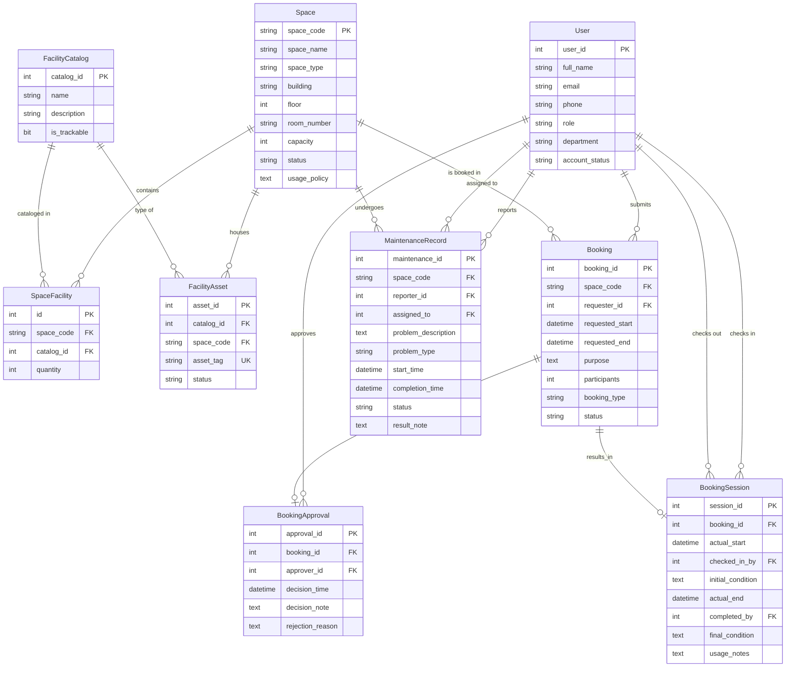

# Conceptual ERD Design

## Group
G11

## Overview
This conceptual ERD models the Campus Space Management System using Crow's Foot notation. The design follows the "Catalog vs. Asset Hybrid Pattern" for facility management: a general `facility_catalog` defines item types, `space_facility` maps catalogs to spaces with quantities, and `facility_asset` individually tracks high-value items.

---

## Entity Summary

| Entity | Description |
|---|---|
| User | A person with a university account (student, lecturer, TA, staff, admin, manager) |
| Space | A bookable physical space (classroom, lab, meeting room, auditorium, etc.) |
| FacilityCatalog | A catalog entry defining a type of facility item (e.g., 'Projector') |
| SpaceFacility | Associative entity linking Space and FacilityCatalog with quantity |
| FacilityAsset | An individually tracked physical asset linked to a catalog and space |
| Booking | A request to use a space for a specific time period |
| BookingApproval | The decision record for a booking (approval/rejection) |
| BookingSession | Check-in/check-out record for a completed booking |
| MaintenanceRecord | A maintenance issue reported for a space |

---

## Mermaid ER Diagram



---

## Relationship Details

| Relationship | Entity 1 | Cardinality | Entity 2 | Cardinality | Participation |
|---|---|---|---|---|---|
| User submits Booking | User | 1 | Booking | N | User: optional, Booking: mandatory |
| User approves Booking | User | 1 | BookingApproval | N | User: optional, BookingApproval: mandatory |
| User checks in BookingSession | User | 1 | BookingSession | N | User: optional, BookingSession: optional |
| User checks out BookingSession | User | 1 | BookingSession | N | User: optional, BookingSession: optional |
| User reports Maintenance | User | 1 | MaintenanceRecord | N | User: optional, MaintenanceRecord: mandatory |
| User assigned to Maintenance | User | 1 | MaintenanceRecord | N | User: optional, MaintenanceRecord: optional |
| Space has Booking | Space | 1 | Booking | N | Space: mandatory, Booking: mandatory |
| Space has Maintenance | Space | 1 | MaintenanceRecord | N | Space: mandatory, MaintenanceRecord: mandatory |
| Space has SpaceFacility | Space | 1 | SpaceFacility | N | Space: mandatory, SpaceFacility: optional |
| Space houses FacilityAsset | Space | 1 | FacilityAsset | N | Space: mandatory, FacilityAsset: optional |
| FacilityCatalog in SpaceFacility | FacilityCatalog | 1 | SpaceFacility | N | FacilityCatalog: mandatory, SpaceFacility: optional |
| FacilityCatalog is type of FacilityAsset | FacilityCatalog | 1 | FacilityAsset | N | FacilityCatalog: mandatory, FacilityAsset: mandatory |
| Booking has BookingApproval | Booking | 1 | BookingApproval | 0..1 | Booking: optional, BookingApproval: mandatory |
| Booking results in BookingSession | Booking | 1 | BookingSession | 0..1 | Booking: optional, BookingSession: mandatory |

---

## Hybrid Pattern Visual Summary

```
Space ──1:N──► SpaceFacility ◄──N:1── FacilityCatalog
  │                                     │
  │1:N                                  │1:N
  └────────────────────────────────────► FacilityAsset
```

- **SpaceFacility** resolves the M:N between Space and FacilityCatalog with a `quantity` attribute.
- **FacilityAsset** handles 1:N tracking for high-value items (when `is_trackable = 1`).
