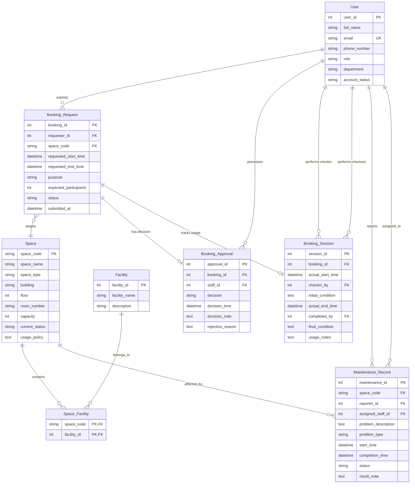

# Conceptual ERD Design

## Entity Set Summary

| Entity | Description |
|---|---|
| User | Individuals who interact with the system (students, lecturers, TAs, staff, admins, managers). |
| Space | A bookable physical room or area. |
| Facility | A type of equipment or amenity available in a space (e.g., projector, whiteboard). |
| Space_Facility | Associative entity linking spaces to their available facilities. |
| Booking_Request | A request submitted by a user to reserve a space for a specific time period and purpose. |
| Booking_Approval | The decision (approve/reject) made by facility staff/manager on a booking request. |
| Booking_Session | The actual usage record including check-in and checkout details. |
| Maintenance_Record | A report of a problem or maintenance activity for a space. |

## Entity-Relationship Diagram (Mermaid)

## Relationship Details

| Relationship | Type | Min | Max | Participation |
|---|---|---|---|---|
| User → Booking_Request (submits) | 1:N | 1 | N | User: mandatory, Booking_Request: mandatory |
| Booking_Request → Space (targets) | N:1 | N | 1 | Both mandatory |
| Space → Space_Facility (contains) | 1:N | 1 | N | Space: mandatory, Space_Facility: mandatory |
| Facility → Space_Facility (belongs_to) | 1:N | 1 | N | Both mandatory |
| Booking_Request → Booking_Approval (has decision) | 1:1 | 0 | 1 | Booking_Request: optional (may be pending) |
| User → Booking_Approval (processes) | 1:N | 1 | N | User (staff): mandatory, Booking_Approval: mandatory |
| Booking_Request → Booking_Session (tracks usage) | 1:1 | 0 | 1 | Booking_Request: optional (only checked-in bookings) |
| User → Booking_Session (performs checkin) | 1:N | 1 | N | Both mandatory |
| User → Booking_Session (performs checkout) | 1:N | 0 | N | User (staff): optional (not all staff do checkout), Booking_Session: optional |
| User → Maintenance_Record (reports) | 1:N | 1 | N | Both mandatory |
| User → Maintenance_Record (assigned_to) | 1:N | 0 | N | User (staff): optional, Maintenance_Record: optional |
| Space → Maintenance_Record (affected_by) | 1:N | 1 | N | Space: mandatory, Maintenance_Record: mandatory |

## Key Constraints

- **User.email**: UNIQUE (each user has a unique email).
- **Space.space_code**: PRIMARY KEY.
- **Facility.facility_name**: UNIQUE (no duplicate facility types).
- **Booking_Request**: No overlapping time periods for the same space with status 'approved' or 'checked_in' or 'completed'.
- **Booking_Approval.booking_id**: UNIQUE (each booking has at most one approval record).
- **Booking_Session.booking_id**: UNIQUE (each booking has at most one session record).
- **Maintenance_Record**: A space with an active maintenance record (status = 'reported' or 'in_progress') blocks new bookings.
