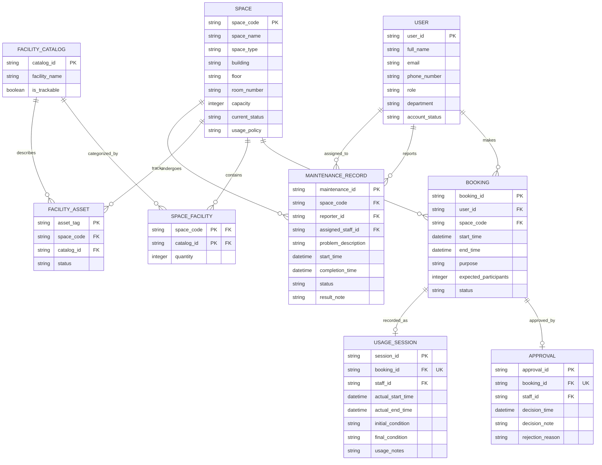

# Conceptual ERD Design - G11

## 1. Entities (extracted from Step 1)

1. USER
2. SPACE
3. FACILITY_CATALOG
4. SPACE_FACILITY (Associative Entity)
5. FACILITY_ASSET
6. BOOKING
7. APPROVAL
8. USAGE_SESSION
9. MAINTENANCE_RECORD

## 2. Relationships (extracted from Step 1)

| Left Entity | Min | Max | Crow's Foot (L) | Crow's Foot (R) | Min | Max | Right Entity | Label |
| :--- | :--- | :--- | :--- | :--- | :--- | :--- | :--- | :--- |
| USER | 1 | 1 | `||` | `o{` | 0 | N | BOOKING | makes |
| SPACE | 1 | 1 | `||` | `o{` | 0 | N | BOOKING | has |
| SPACE | 1 | 1 | `||` | `o{` | 0 | N | SPACE_FACILITY | contains |
| FACILITY_CATALOG | 1 | 1 | `||` | `o{` | 0 | N | SPACE_FACILITY | categorized_by |
| SPACE | 1 | 1 | `||` | `o{` | 0 | N | FACILITY_ASSET | tracks |
| FACILITY_CATALOG | 1 | 1 | `||` | `o{` | 0 | N | FACILITY_ASSET | describes |
| BOOKING | 1 | 1 | `||` | `o|` | 0 | 1 | APPROVAL | approved_by |
| BOOKING | 1 | 1 | `||` | `o|` | 0 | 1 | USAGE_SESSION | recorded_as |
| SPACE | 1 | 1 | `||` | `o{` | 0 | N | MAINTENANCE_RECORD | undergoes |
| USER | 1 | 1 | `||` | `o{` | 0 | N | MAINTENANCE_RECORD | reports |
| USER | 1 | 1 | `||` | `o{` | 0 | N | MAINTENANCE_RECORD | assigned_to |

## 3. Mermaid ER Diagram

## 4. Assumptions and Gaps

- **Maintenance status values** are not enumerated in Step 1 (OQ-01). The ERD uses a generic `string status` without constraints.
- **Account status values** are not enumerated in Step 1 (OQ-02). Same approach — generic `string`.
- No ISA/subtype hierarchies exist in Step 1.
- The `floor` attribute is typed as `string` to accommodate non-numeric values (e.g., "G" for ground).
