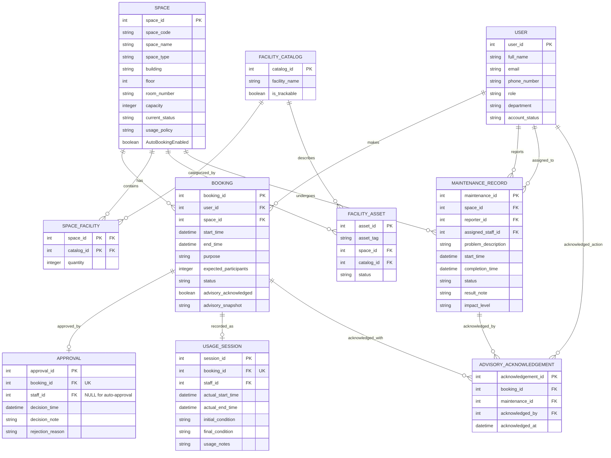

# Updated ERD & Logical Design - G11 (Phase 2)

**Baseline:** Phase 1 `02-erd-design-G11.md` and `03-logical-design-G11.md`. All Phase 2 changes are **additive**. New/modified elements are marked **NEW** / **MODIFIED**; everything else is **RETAINED** from Phase 1.

---

## 1. Updated Conceptual ERD

### 1.1 Entity List (Phase 2)

| Entity | Status | Notes |
| :--- | :--- | :--- |
| USER | RETAINED | unchanged |
| SPACE | MODIFIED | + `AutoBookingEnabled` |
| FACILITY_CATALOG | RETAINED | unchanged |
| SPACE_FACILITY | RETAINED | unchanged |
| FACILITY_ASSET | RETAINED | unchanged |
| BOOKING | MODIFIED | + `advisory_acknowledged`, + `advisory_snapshot` |
| APPROVAL | MODIFIED | `staff_id` now NULLABLE (auto-approval actor) |
| USAGE_SESSION | RETAINED | unchanged |
| MAINTENANCE_RECORD | MODIFIED | + `impact_level` |
| **ADVISORY_ACKNOWLEDGEMENT** | **NEW** | associative: BOOKING ↔ MAINTENANCE_RECORD |

### 1.2 Updated Relationship List

| Left Entity | Min | Max | Crow's Foot (L) | Crow's Foot (R) | Min | Max | Right Entity | Label | Status |
| :--- | :--- | :--- | :--- | :--- | :--- | :--- | :--- | :--- | :--- |
| USER | 1 | 1 | `||` | `o{` | 0 | N | BOOKING | makes | RETAINED |
| SPACE | 1 | 1 | `||` | `o{` | 0 | N | BOOKING | has | RETAINED |
| SPACE | 1 | 1 | `||` | `o{` | 0 | N | SPACE_FACILITY | contains | RETAINED |
| FACILITY_CATALOG | 1 | 1 | `||` | `o{` | 0 | N | SPACE_FACILITY | categorized_by | RETAINED |
| SPACE | 1 | 1 | `||` | `o{` | 0 | N | FACILITY_ASSET | tracks | RETAINED |
| FACILITY_CATALOG | 1 | 1 | `||` | `o{` | 0 | N | FACILITY_ASSET | describes | RETAINED |
| BOOKING | 1 | 1 | `||` | `o|` | 0 | 1 | APPROVAL | approved_by | RETAINED |
| BOOKING | 1 | 1 | `||` | `o|` | 0 | 1 | USAGE_SESSION | recorded_as | RETAINED |
| SPACE | 1 | 1 | `||` | `o{` | 0 | N | MAINTENANCE_RECORD | undergoes | RETAINED |
| USER | 1 | 1 | `||` | `o{` | 0 | N | MAINTENANCE_RECORD | reports | RETAINED |
| USER | 1 | 1 | `||` | `o{` | 0 | N | MAINTENANCE_RECORD | assigned_to | RETAINED |
| BOOKING | 1 | 1 | `||` | `o{` | 0 | N | **ADVISORY_ACKNOWLEDGEMENT** | acknowledged_with | **NEW** |
| MAINTENANCE_RECORD | 1 | 1 | `||` | `o{` | 0 | N | **ADVISORY_ACKNOWLEDGEMENT** | acknowledged_by | **NEW** |
| USER | 1 | 1 | `||` | `o{` | 0 | N | **ADVISORY_ACKNOWLEDGEMENT** | acknowledged (action) | **NEW** |

**Participation semantics:** a booking that acknowledges a given advisory creates exactly one row linking that booking to that maintenance record (UNIQUE on `(booking_id, maintenance_id)`). A booking may acknowledge zero or many advisories; a maintenance record may be acknowledged by zero or many bookings.

### 1.3 Updated Mermaid ER Diagram

---

## 2. Updated Relational Schema (Logical)

Column names use strict `snake_case`. Changes relative to Phase 1 are shown with **[ADD]** / **[MOD]** markers.

### TABLE: `spaces` (Phase 1 + new column)

| Column Name | Data Type | Constraints & Keys |
| :--- | :--- | :--- |
| space_id | INT | IDENTITY(1,1) PRIMARY KEY |
| space_code | NVARCHAR(20) | NOT NULL UNIQUE |
| space_name | NVARCHAR(100) | NOT NULL |
| space_type | NVARCHAR(50) | NOT NULL |
| building | NVARCHAR(100) | NOT NULL |
| floor | INT | NOT NULL |
| room_number | NVARCHAR(20) | NOT NULL |
| capacity | INT | NOT NULL CHECK (capacity > 0) |
| current_status | NVARCHAR(20) | NOT NULL CHECK (current_status IN ('Available', 'In Use', 'Under Maintenance', 'Temporarily Closed', 'Retired')) |
| usage_policy | NVARCHAR(MAX) | |
| **AutoBookingEnabled** **[ADD]** | BIT | NOT NULL DEFAULT (0) |

> **[MOD]** RC-05 / A-08: `AutoBookingEnabled = 1` marks a space eligible for the automatic approval path. Safe default `0` (off) for all existing/new spaces.

### TABLE: `bookings` (Phase 1 + new columns)

| Column Name | Data Type | Constraints & Keys |
| :--- | :--- | :--- |
| booking_id | INT | IDENTITY(1,1) PRIMARY KEY |
| user_id | INT | NOT NULL FK REFERENCES users(user_id) |
| space_id | INT | NOT NULL FK REFERENCES spaces(space_id) |
| start_time | DATETIME2 | NOT NULL |
| end_time | DATETIME2 | NOT NULL CHECK (end_time > start_time) |
| purpose | NVARCHAR(50) | NOT NULL CHECK (purpose IN ('Lecture', 'Examination', 'Seminar', 'Workshop', 'Meeting', 'Student Activity', 'Administrative Event')) |
| expected_participants | INT | CHECK (expected_participants > 0) |
| status | NVARCHAR(20) | NOT NULL CHECK (status IN ('Pending', 'Approved', 'Rejected', 'Cancelled', 'Checked In', 'Completed', 'No-show')) |
| **advisory_acknowledged** **[ADD]** | BIT | NOT NULL DEFAULT (0) CHECK (advisory_acknowledged IN (0, 1)) |
| **advisory_snapshot** **[ADD]** | NVARCHAR(MAX) | NULL |

> **[MOD]** RC-03 / A-03: `advisory_acknowledged` records that the requester was informed of all active advisories at booking time; `advisory_snapshot` stores the advisory text shown (audit). Per-advisory detail is stored in `advisory_acknowledgements`.

### TABLE: `advisory_acknowledgements` (NEW — RC-03)

| Column Name | Data Type | Constraints & Keys |
| :--- | :--- | :--- |
| acknowledgement_id | INT | IDENTITY(1,1) PRIMARY KEY |
| booking_id | INT | NOT NULL UNIQUE-PAIR FK REFERENCES bookings(booking_id) |
| maintenance_id | INT | NOT NULL UNIQUE-PAIR FK REFERENCES maintenance_records(maintenance_id) |
| acknowledged_by | INT | NOT NULL FK REFERENCES users(user_id) |
| acknowledged_at | DATETIME2 | NOT NULL DEFAULT (SYSDATETIME()) |

> **Keys:** UNIQUE on `(booking_id, maintenance_id)` — a given advisory is acknowledged at most once per booking.
> **Business rule BR-P2-01:** one row per (booking, advisory) pair records that this requester acknowledged this advisory.

### TABLE: `maintenance_records` (Phase 1 + new column)

| Column Name | Data Type | Constraints & Keys |
| :--- | :--- | :--- |
| maintenance_id | INT | IDENTITY(1,1) PRIMARY KEY |
| space_id | INT | NOT NULL FK REFERENCES spaces(space_id) |
| reporter_id | INT | NOT NULL FK REFERENCES users(user_id) |
| assigned_staff_id | INT | FK REFERENCES users(user_id) |
| problem_description | NVARCHAR(MAX) | NOT NULL |
| start_time | DATETIME2 | NOT NULL |
| completion_time | DATETIME2 | |
| status | NVARCHAR(20) | NOT NULL |
| result_note | NVARCHAR(MAX) | |
| **impact_level** **[ADD]** | NVARCHAR(20) | NOT NULL DEFAULT ('out-of-service') CHECK (impact_level IN ('out-of-service', 'advisory')) |

> **[MOD]** RC-01 / A-01 / A-02: exact enumeration `'out-of-service'` (blocks overlapping bookings, Phase 1 semantics) and `'advisory'` (bookable with acknowledgement). Default `'out-of-service'` preserves the Phase 1 rule for pre-existing records.

### TABLE: `approvals` (Phase 1 + relaxed nullability)

| Column Name | Data Type | Constraints & Keys |
| :--- | :--- | :--- |
| approval_id | INT | IDENTITY(1,1) PRIMARY KEY |
| booking_id | INT | NOT NULL UNIQUE FK REFERENCES bookings(booking_id) |
| **staff_id** **[MOD]** | INT | **NULL** (was NOT NULL) FK REFERENCES users(user_id) |
| decision_time | DATETIME2 | NOT NULL |
| decision_note | NVARCHAR(MAX) | |
| rejection_reason | NVARCHAR(MAX) | |

> **[MOD]** RC-05a / BR-P2-03: `staff_id` is relaxed from `NOT NULL` to `NULL` so that **automatic approvals** can be recorded with `staff_id = NULL` (no human actor). **Manual/staff approvals** continue to store the deciding staff member. The FK `users(user_id)` and existing rows are preserved (migration is data-safe).

---

## 3. Referential Integrity (new/changed FKs)

| From Table | From Column | To Table | To Column | ON UPDATE | ON DELETE | Business Justification |
| :--- | :--- | :--- | :--- | :--- | :--- | :--- |
| advisory_acknowledgements | booking_id | bookings | booking_id | NO ACTION | NO ACTION | Preserve acknowledgement audit history (BR-07). |
| advisory_acknowledgements | maintenance_id | maintenance_records | maintenance_id | NO ACTION | NO ACTION | Preserve the linkage to the maintenance record even after the record is closed. |
| advisory_acknowledgements | acknowledged_by | users | user_id | NO ACTION | NO ACTION | Preserve who acknowledged. |
| approvals | staff_id | users | user_id | NO ACTION | NO ACTION | **Kept from Phase 1** (column now nullable; FK unchanged). Preserve approval audit (BR-07). |

---

## 4. Change Diff (Phase 1 → Phase 2)

| Element | Phase 1 | Phase 2 | Change | Step 8 Ref |
| :--- | :--- | :--- | :--- | :--- |
| `spaces` | — | + `AutoBookingEnabled BIT NOT NULL DEFAULT (0)` | ADD column | RC-05 |
| `bookings` | — | + `advisory_acknowledged BIT NOT NULL DEFAULT (0)` | ADD column | RC-03 |
| `bookings` | — | + `advisory_snapshot NVARCHAR(MAX) NULL` | ADD column | RC-03 |
| `maintenance_records` | — | + `impact_level NVARCHAR(20) CHECK IN ('out-of-service','advisory') DEFAULT 'out-of-service'` | ADD column + CHECK | RC-01 |
| `advisory_acknowledgements` | *(new table)* | `(acknowledgement_id PK, booking_id FK, maintenance_id FK, acknowledged_by FK, acknowledged_at)` | NEW table | RC-03, BR-P2-01 |
| `approvals.staff_id` | NOT NULL | **NULL** (relaxed, FK preserved) | ALTER column nullability | RC-05a |
| BR-01 | app-level scan | concurrency-controlled (locking/isolation) | RULE-LEVEL | RC-06 |
| BR-02 | any maintenance blocks booking | only `out-of-service` blocks; `advisory` → bookable with acknowledgement | RULE-LEVEL (refined) | RC-01 |
| BR-02 sub-rule | — | bookable-but-notified (acknowledgement stored) | ADDED | RC-03 |
| APPROVAL | staff decision only | also records auto-approval actor | USAGE refined | RC-05 |
| All Phase 1 tables/relationships | — | retained as-is | RETAINED | — |

---

## 5. Entity-to-Table Traceability (updated)

| Entity | Table | Status |
| :--- | :--- | :--- |
| USER | users | RETAINED |
| SPACE | spaces | MODIFIED (AutoBookingEnabled) |
| FACILITY_CATALOG | facility_catalog | RETAINED |
| SPACE_FACILITY | space_facility | RETAINED |
| FACILITY_ASSET | facility_assets | RETAINED |
| BOOKING | bookings | MODIFIED (advisory_acknowledged, advisory_snapshot) |
| APPROVAL | approvals | MODIFIED (staff_id nullable) |
| USAGE_SESSION | usage_sessions | RETAINED |
| MAINTENANCE_RECORD | maintenance_records | MODIFIED (impact_level) |
| ADVISORY_ACKNOWLEDGEMENT | advisory_acknowledgements | NEW |

---

## 6. Phase 2 Design Requirement Traceability

| Step 8 Change | Present in Updated Design | Where |
| :--- | :--- | :--- |
| RC-01 impact_level | YES | §2 `maintenance_records.impact_level` |
| RC-02 multiple active records | YES | No schema change; 1:N retained + aggregate availability logic |
| RC-03 advisory acknowledgement | YES | §2 `bookings.advisory_acknowledged`/`advisory_snapshot` + `advisory_acknowledgements` |
| RC-04 escalation/downgrade + affected bookings | YES | `impact_level` mutable + report in output 16 (Q4) |
| RC-05 auto approval for selected spaces | YES | §2 `spaces.AutoBookingEnabled` |
| RC-05a nullable APPROVAL.staff_id | YES | §2 `approvals.staff_id` NULL + `sp_AutoApproveBookingRequest` (output 12) |
| RC-06 concurrency control | YES | Outputs 11–13 (locking/isolation design) |
| RC-07…RC-10 reports | YES | Output 16 (analytical queries) |

---

## 7. Assumptions

- **A-01:** new maintenance records default to `out-of-service` (safe; matches Phase 1 blocking).
- **A-03:** `advisory_acknowledged` flag + `advisory_snapshot` text + `advisory_acknowledgements` rows together satisfy "record that the requester was informed".
- **A-08:** `AutoBookingEnabled` defaults to `0` so no space is silently auto-bookable.
- **A-05:** `approvals.staff_id = NULL` denotes an automatic approval; manual approvals always record a staff member.
- `advisory_acknowledgements.acknowledged_by` references the requesting user (who accepted the advisories).
