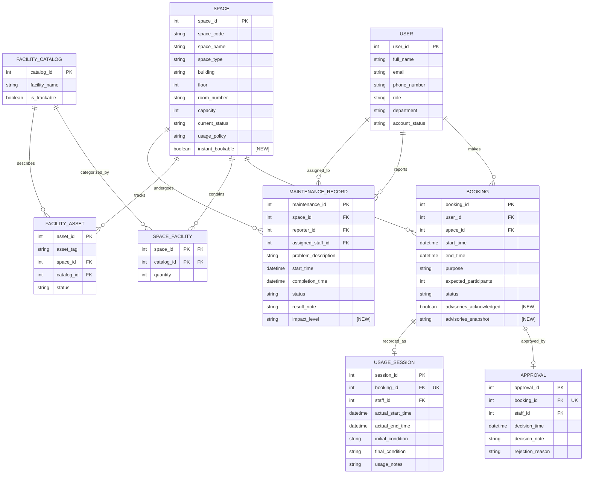

# Updated ERD and Logical Design - G11 (Phase 2)

## 1. Phase 2 Design Changes (from `08-requirement-change-analysis-G11.md`)

| Change ID | Design Action | Type |
| :--- | :--- | :--- |
| RC-01 | `MAINTENANCE_RECORD` gains `impact_level` attribute. | ADD attribute |
| RC-03 | `BOOKING` gains acknowledgement attributes. | ADD attribute |
| RC-04 | `impact_level` becomes mutable + reporting query. | RULE + QUERY |
| RC-05 / RC-06 | Instant booking path (`SPACE.instant_bookable` flag); BR-01 delegated to concurrency control. | ADD attribute + RULE / DELEGATED |
| RC-07 … RC-10 | New analytical queries (see Step 8 / output 16). | QUERY |

No new entities are required. All changes are additive attributes and rule refinements on the existing 9-entity model.

---

## 2. Updated Conceptual ERD

### 2.1 Entity Inventory

| Entity | Status |
| :--- | :--- |
| USER | Retained (unchanged) |
| SPACE | **Extended** (added attribute) |
| FACILITY_CATALOG | Retained (unchanged) |
| SPACE_FACILITY | Retained (unchanged) |
| FACILITY_ASSET | Retained (unchanged) |
| BOOKING | **Extended** (added attributes) |
| APPROVAL | Retained (unchanged) |
| USAGE_SESSION | Retained (unchanged) |
| MAINTENANCE_RECORD | **Extended** (added attribute) |

### 2.2 Updated Attributes

**BOOKING** — added attributes marked **[NEW]**:

| Attribute | Conceptual Type | Status |
| :--- | :--- | :--- |
| booking_id | int | Retained (PK) |
| user_id | int | Retained (FK) |
| space_id | int | Retained (FK) |
| start_time | datetime | Retained |
| end_time | datetime | Retained |
| purpose | string | Retained |
| expected_participants | int | Retained |
| status | string | Retained |
| **advisories_acknowledged** | boolean | **[NEW]** RC-03 |
| **advisories_snapshot** | string (multi-line) | **[NEW]** RC-03 |

**SPACE** — added attribute marked **[NEW]**:

| Attribute | Conceptual Type | Status |
| :--- | :--- | :--- |
| space_id | int | Retained (PK) |
| space_code | string | Retained (unique) |
| space_name | string | Retained |
| space_type | string | Retained |
| building | string | Retained |
| floor | int | Retained |
| room_number | string | Retained |
| capacity | int | Retained |
| current_status | string | Retained |
| usage_policy | string | Retained |
| **instant_bookable** | boolean | **[NEW]** RC-05 — marks the space as eligible for the instant-approval path |

**MAINTENANCE_RECORD** — added attribute marked **[NEW]**:

| Attribute | Conceptual Type | Status |
| :--- | :--- | :--- |
| maintenance_id | int | Retained (PK) |
| space_id | int | Retained (FK) |
| reporter_id | int | Retained (FK) |
| assigned_staff_id | int | Retained (FK, optional) |
| problem_description | string | Retained |
| start_time | datetime | Retained |
| completion_time | datetime | Retained (nullable) |
| status | string | Retained |
| result_note | string | Retained (nullable) |
| **impact_level** | string | **[NEW]** RC-01 |

### 2.3 Updated Relationships

All Phase 1 relationships are retained unchanged. No new relationships. New semantics (not new cardinalities):

| Relationship | Phase 2 Semantics | Cardinality |
| :--- | :--- | :--- |
| SPACE undergoes MAINTENANCE_RECORD | A space may have several active maintenance records with different impact levels concurrently (RC-02). | 1:N (unchanged) |
| BOOKING approved_by APPROVAL | Approval record used for both staff decisions and instant (auto) approvals. | 1:1 (unchanged) |

### 2.4 Updated Mermaid ER Diagram

---

## 3. Updated Relational Schema (Logical)

### TABLE: `users` — **Unchanged from Phase 1**

| Column Name | Data Type | Constraints & Keys |
| :--- | :--- | :--- |
| user_id | INT | IDENTITY(1,1) PRIMARY KEY |
| full_name | NVARCHAR(255) | NOT NULL |
| email | NVARCHAR(255) | NOT NULL UNIQUE |
| phone_number | NVARCHAR(20) | NOT NULL |
| role | NVARCHAR(50) | NOT NULL CHECK (role IN ('Student','Lecturer','Teaching Assistant','Facility Staff','Department Administrator','Facility Manager')) |
| department | NVARCHAR(100) | NOT NULL |
| account_status | NVARCHAR(20) | NOT NULL DEFAULT 'Active' |

### TABLE: `spaces` — **Extended (RC-05)**

| Column Name | Data Type | Constraints & Keys |
| :--- | :--- | :--- |
| space_id | INT | IDENTITY(1,1) PRIMARY KEY |
| space_code | NVARCHAR(20) | NOT NULL UNIQUE |
| space_name | NVARCHAR(100) | NOT NULL |
| space_type | NVARCHAR(50) | NOT NULL |
| building | NVARCHAR(100) | NOT NULL |
| floor | INT | NOT NULL |
| room_number | NVARCHAR(20) | NOT NULL |
| capacity | INT | NOT NULL CHECK (capacity > 0) |
| current_status | NVARCHAR(20) | NOT NULL CHECK (current_status IN ('Available','In Use','Under Maintenance','Temporarily Closed','Retired')) |
| usage_policy | NVARCHAR(MAX) | |
| **instant_bookable** | **BIT** | **[NEW]** NOT NULL DEFAULT 0 — space eligible for instant auto-approval when usage policy is satisfied (RC-05) |

### TABLE: `facility_catalog` — **Unchanged from Phase 1**

| Column Name | Data Type | Constraints & Keys |
| :--- | :--- | :--- |
| catalog_id | INT | IDENTITY(1,1) PRIMARY KEY |
| facility_name | NVARCHAR(100) | NOT NULL |
| is_trackable | BIT | NOT NULL |

### TABLE: `space_facility` — **Unchanged from Phase 1**

| Column Name | Data Type | Constraints & Keys |
| :--- | :--- | :--- |
| space_id | INT | NOT NULL PK FK REFERENCES spaces(space_id) |
| catalog_id | INT | NOT NULL PK FK REFERENCES facility_catalog(catalog_id) |
| quantity | INT | NOT NULL CHECK (quantity >= 0) |

> Primary Key: (space_id, catalog_id)

### TABLE: `facility_assets` — **Unchanged from Phase 1**

| Column Name | Data Type | Constraints & Keys |
| :--- | :--- | :--- |
| asset_id | INT | IDENTITY(1,1) PRIMARY KEY |
| asset_tag | NVARCHAR(50) | NOT NULL UNIQUE |
| space_id | INT | NOT NULL FK REFERENCES spaces(space_id) |
| catalog_id | INT | NOT NULL FK REFERENCES facility_catalog(catalog_id) |
| status | NVARCHAR(50) | NOT NULL |

### TABLE: `bookings` — **Extended (RC-03)**

| Column Name | Data Type | Constraints & Keys |
| :--- | :--- | :--- |
| booking_id | INT | IDENTITY(1,1) PRIMARY KEY |
| user_id | INT | NOT NULL FK REFERENCES users(user_id) |
| space_id | INT | NOT NULL FK REFERENCES spaces(space_id) |
| start_time | DATETIME2 | NOT NULL |
| end_time | DATETIME2 | NOT NULL CHECK (end_time > start_time) |
| purpose | NVARCHAR(50) | NOT NULL CHECK (purpose IN ('Lecture','Examination','Seminar','Workshop','Meeting','Student Activity','Administrative Event')) |
| expected_participants | INT | CHECK (expected_participants > 0) |
| status | NVARCHAR(20) | NOT NULL CHECK (status IN ('Pending','Approved','Rejected','Cancelled','Checked In','Completed','No-show')) |
| **advisories_acknowledged** | **BIT** | **[NEW]** NOT NULL DEFAULT 0 — records that the requester was informed of active advisory maintenance (RC-03) |
| **advisories_snapshot** | **NVARCHAR(MAX)** | **[NEW]** NULL — snapshot of advisory maintenance descriptions shown at booking time (RC-03) |

### TABLE: `approvals` — **Unchanged from Phase 1**

| Column Name | Data Type | Constraints & Keys |
| :--- | :--- | :--- |
| approval_id | INT | IDENTITY(1,1) PRIMARY KEY |
| booking_id | INT | NOT NULL UNIQUE FK REFERENCES bookings(booking_id) |
| staff_id | INT | NOT NULL FK REFERENCES users(user_id) |
| decision_time | DATETIME2 | NOT NULL |
| decision_note | NVARCHAR(MAX) | |
| rejection_reason | NVARCHAR(MAX) | |

### TABLE: `usage_sessions` — **Unchanged from Phase 1**

| Column Name | Data Type | Constraints & Keys |
| :--- | :--- | :--- |
| session_id | INT | IDENTITY(1,1) PRIMARY KEY |
| booking_id | INT | NOT NULL UNIQUE FK REFERENCES bookings(booking_id) |
| staff_id | INT | FK REFERENCES users(user_id) |
| actual_start_time | DATETIME2 | |
| actual_end_time | DATETIME2 | CHECK (actual_end_time > actual_start_time) |
| initial_condition | NVARCHAR(MAX) | |
| final_condition | NVARCHAR(MAX) | |
| usage_notes | NVARCHAR(MAX) | |

### TABLE: `maintenance_records` — **Extended (RC-01)**

| Column Name | Data Type | Constraints & Keys |
| :--- | :--- | :--- |
| maintenance_id | INT | IDENTITY(1,1) PRIMARY KEY |
| space_id | INT | NOT NULL FK REFERENCES spaces(space_id) |
| reporter_id | INT | NOT NULL FK REFERENCES users(user_id) |
| assigned_staff_id | INT | FK REFERENCES users(user_id) |
| problem_description | NVARCHAR(MAX) | NOT NULL |
| start_time | DATETIME2 | NOT NULL |
| completion_time | DATETIME2 | |
| status | NVARCHAR(20) | NOT NULL |
| result_note | NVARCHAR(MAX) | |
| **impact_level** | **NVARCHAR(20)** | **[NEW]** NOT NULL DEFAULT 'out-of-service' CHECK (impact_level IN ('out-of-service','advisory')) (RC-01) |

---

## 4. Referential Integrity (new/changed FKs)

There are **no new foreign keys** in Phase 2. The only schema additions are two columns on `bookings` and one on `maintenance_records`, none of which are keys. All Phase 1 FK referential actions are retained:

| From Table | From Column | To Table | To Column | ON UPDATE | ON DELETE | Business Justification |
| :--- | :--- | :--- | :--- | :--- | :--- | :--- |
| space_facility | space_id | spaces | space_id | NO ACTION | NO ACTION | Retained (Phase 1) |
| space_facility | catalog_id | facility_catalog | catalog_id | NO ACTION | NO ACTION | Retained (Phase 1) |
| facility_assets | space_id | spaces | space_id | NO ACTION | NO ACTION | Retained |
| facility_assets | catalog_id | facility_catalog | catalog_id | NO ACTION | NO ACTION | Retained |
| bookings | user_id | users | user_id | NO ACTION | NO ACTION | Retained |
| bookings | space_id | spaces | space_id | NO ACTION | NO ACTION | Retained |
| approvals | booking_id | bookings | booking_id | NO ACTION | NO ACTION | Retained (historical preservation) |
| approvals | staff_id | users | user_id | NO ACTION | NO ACTION | Retained |
| usage_sessions | booking_id | bookings | booking_id | NO ACTION | NO ACTION | Retained |
| usage_sessions | staff_id | users | user_id | NO ACTION | NO ACTION | Retained |
| maintenance_records | space_id | spaces | space_id | NO ACTION | NO ACTION | Retained |
| maintenance_records | reporter_id | users | user_id | NO ACTION | NO ACTION | Retained |
| maintenance_records | assigned_staff_id | users | user_id | NO ACTION | NO ACTION | Retained |

---

## 5. Change-Diff vs Phase 1

| Element | Phase 1 | Phase 2 | Change Type | Trace |
| :--- | :--- | :--- | :--- | :--- |
| MAINTENANCE_RECORD.impact_level | — | NVARCHAR(20), NOT NULL DEFAULT 'out-of-service', CHECK ('out-of-service','advisory') | ADD attribute | RC-01 |
| BOOKING.advisories_acknowledged | — | BIT NOT NULL DEFAULT 0 | ADD attribute | RC-03 |
| BOOKING.advisories_snapshot | — | NVARCHAR(MAX) NULL | ADD attribute | RC-03 |
| SPACE.instant_bookable | — | BIT NOT NULL DEFAULT 0 | ADD attribute | RC-05 |
| BR-02 (blocking rule) | all maintenance blocks | only `out-of-service` blocks; `advisory` → bookable-with-acknowledgement | REFINED rule | RC-01 |
| BR-01 (no overlap) | app-level scan | enforced via concurrency control | DELEGATED | RC-06 |
| SPACE undergoes MAINTENANCE_RECORD | 1:N | 1:N with multiple concurrent active records, mixed impact levels | EXTENDED semantics | RC-02 |
| BOOKING ↔ APPROVAL | 1:1 staff decision | 1:1 used for staff and instant approvals | EXTENDED usage | RC-05 |
| Reports | — | 4 new analytical queries | ADD query | RC-07…RC-10 |

## 6. Entity-to-Table Traceability (updated model)

| Entity | Table | Phase 2 Status |
| :--- | :--- | :--- |
| USER | users | Retained |
| SPACE | spaces | Extended |
| FACILITY_CATALOG | facility_catalog | Retained |
| SPACE_FACILITY | space_facility | Retained |
| FACILITY_ASSET | facility_assets | Retained |
| BOOKING | bookings | Extended |
| APPROVAL | approvals | Retained |
| USAGE_SESSION | usage_sessions | Retained |
| MAINTENANCE_RECORD | maintenance_records | Extended |

## 7. Design Cross-Check Against Step 8

| Change (Step 8) | Incorporated? | Where |
| :--- | :--- | :--- |
| RC-01 impact levels | YES | `maintenance_records.impact_level` |
| RC-02 multiple concurrent active records | YES | Retained 1:N; rule documented |
| RC-03 acknowledgement stored with booking | YES | `bookings.advisories_acknowledged`, `bookings.advisories_snapshot` |
| RC-04 escalation + affected bookings | YES | Mutable `impact_level`; reporting query in Step 8 |
| RC-05 instant booking | YES | `spaces.instant_bookable` + APPROVAL reuse; BR-P2-03 documented |
| RC-06 concurrent booking/approval | YES | BR-01 delegated to concurrency control (Steps 4–5) |
| RC-07…RC-10 reports | YES | Output 16 (Step 8 of pipeline) |
