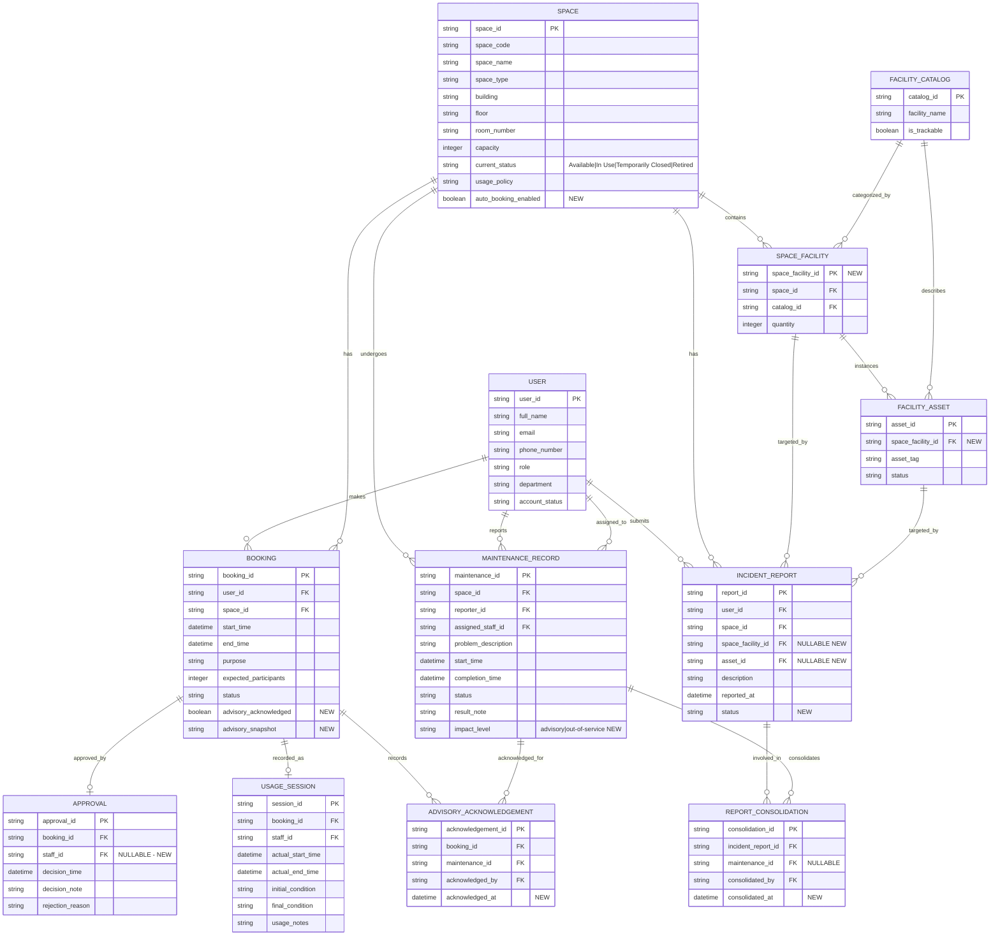

# Updated ERD & Logical Design - G11 (Phase 2)

Baseline: `outputs/02-erd-design-G11.md` (Phase 1 ERD), `outputs/03-logical-design-G11.md` (Phase 1 logical schema). This document applies **only additive** Phase 2 changes identified in `outputs/08-requirement-change-analysis-G11.md`.

---

## 1. Updated Conceptual ERD

### 1.1 New Entities (vs. Phase 1)

| Entity | New? | Purpose |
| :--- | :--- | :--- |
| INCIDENT_REPORT | **NEW** | End-user issue report intake (room / facility-type / asset target). |
| REPORT_CONSOLIDATION | **NEW** | M:N link: many incident reports consolidated into one maintenance record (triage). |
| ADVISORY_ACKNOWLEDGEMENT | **NEW** | Records that a requester was informed of (and acknowledged) active advisories at booking time. |

### 1.2 Modified Entities

| Entity | Modification |
| :--- | :--- |
| SPACE | `current_status` value set loses `Under Maintenance`; gains `auto_booking_enabled` flag. |
| SPACE_FACILITY | Becomes independent entity with surrogate key `space_facility_id`; `(space_id, catalog_id)` kept unique. |
| FACILITY_ASSET | Re-pointed to SPACE_FACILITY instance instead of (SPACE, FACILITY_CATALOG). |
| MAINTENANCE_RECORD | Gains `impact_level` (advisory / out-of-service), default `advisory`. |
| BOOKING | Gains advisory acknowledgement flag + snapshot. |
| APPROVAL | `staff_id` becomes optional (nullable) for automatic approvals. |

### 1.3 Relationship & Cardinality Table

| Left Entity | Min | Max | Crow's Foot (L) | Crow's Foot (R) | Min | Max | Right Entity | Label |
| :--- | :--- | :--- | :--- | :--- | :--- | :--- | :--- | :--- |
| USER | 1 | 1 | `||` | `o{` | 0 | N | BOOKING | makes |
| SPACE | 1 | 1 | `||` | `o{` | 0 | N | BOOKING | has |
| SPACE | 1 | 1 | `||` | `o{` | 0 | N | SPACE_FACILITY | contains |
| FACILITY_CATALOG | 1 | 1 | `||` | `o{` | 0 | N | SPACE_FACILITY | categorized_by |
| SPACE_FACILITY | 1 | 1 | `||` | `o{` | 0 | N | FACILITY_ASSET | instances |
| FACILITY_CATALOG | 1 | 1 | `||` | `o{` | 0 | N | FACILITY_ASSET | describes |
| BOOKING | 1 | 1 | `||` | `o|` | 0 | 1 | APPROVAL | approved_by |
| BOOKING | 1 | 1 | `||` | `o|` | 0 | 1 | USAGE_SESSION | recorded_as |
| SPACE | 1 | 1 | `||` | `o{` | 0 | N | MAINTENANCE_RECORD | undergoes |
| USER | 1 | 1 | `||` | `o{` | 0 | N | MAINTENANCE_RECORD | reports |
| USER | 1 | 1 | `||` | `o{` | 0 | N | MAINTENANCE_RECORD | assigned_to |
| USER | 1 | 1 | `||` | `o{` | 0 | N | INCIDENT_REPORT | submits |
| SPACE | 1 | 1 | `||` | `o{` | 0 | N | INCIDENT_REPORT | has |
| SPACE_FACILITY | 0 | 1 | `o|` | `o{` | 0 | N | INCIDENT_REPORT | targeted_by |
| FACILITY_ASSET | 0 | 1 | `o|` | `o{` | 0 | N | INCIDENT_REPORT | targeted_by |
| INCIDENT_REPORT | 1 | 1 | `||` | `o{` | 0 | N | REPORT_CONSOLIDATION | involved_in |
| MAINTENANCE_RECORD | 0 | 1 | `o|` | `o{` | 0 | N | REPORT_CONSOLIDATION | consolidates |
| BOOKING | 1 | 1 | `||` | `o{` | 0 | N | ADVISORY_ACKNOWLEDGEMENT | records |
| MAINTENANCE_RECORD | 1 | 1 | `||` | `o{` | 0 | N | ADVISORY_ACKNOWLEDGEMENT | acknowledged_for |

### 1.4 Report-Target Hierarchy

`SPACE` → `SPACE_FACILITY` (a facility type present in a room) → `FACILITY_ASSET` (a specific tracked unit).
`INCIDENT_REPORT` participates optionally at the facility-instance and asset levels:

- Room-level: `space_id` set, `space_facility_id` = NULL, `asset_id` = NULL.
- Facility-type-in-room: `space_id` set, `space_facility_id` set, `asset_id` = NULL.
- Specific asset: `space_id` set, `space_facility_id` set, `asset_id` set (asset must belong to that facility instance).

### 1.5 Mermaid ER Diagram (Updated, Conceptual)

---

## 2. Updated Relational Schema (Logical)

> Column names in strict `snake_case`. New columns marked **[NEW]**.

### TABLE: `spaces` *(changed)*

| Column Name | Data Type | Constraints & Keys |
| :--- | :--- | :--- |
| space_id | INT | IDENTITY(1,1) PRIMARY KEY |
| space_code | NVARCHAR(20) | NOT NULL UNIQUE |
| space_name | NVARCHAR(100) | NOT NULL |
| space_type | NVARCHAR(50) | NOT NULL |
| building | NVARCHAR(100) | NOT NULL |
| floor | INT | NOT NULL |
| room_number | NVARCHAR(20) | NOT NULL |
| capacity | INT | NOT NULL CHECK (capacity > 0) |
| current_status | NVARCHAR(20) | NOT NULL CHECK (current_status IN ('Available', 'In Use', 'Temporarily Closed', 'Retired')) — `Under Maintenance` removed |
| usage_policy | NVARCHAR(MAX) | |
| auto_booking_enabled **[NEW]** | BIT | NOT NULL DEFAULT (0) |

> Booking eligibility for maintenance is **no longer derived from `current_status`**. It is evaluated by overlapping `MAINTENANCE_RECORD` rows with `impact_level = 'out-of-service'` (see BR-02 refined).

### TABLE: `space_facility` *(normalized)*

| Column Name | Data Type | Constraints & Keys |
| :--- | :--- | :--- |
| space_facility_id **[NEW]** | INT | IDENTITY(1,1) PRIMARY KEY |
| space_id | INT | NOT NULL FK REFERENCES spaces(space_id) |
| catalog_id | INT | NOT NULL FK REFERENCES facility_catalog(catalog_id) |
| quantity | INT | NOT NULL CHECK (quantity >= 0) |

> **UNIQUE (space_id, catalog_id)** — a facility type cannot be duplicated in the same room. Old composite PK becomes the natural-key unique constraint.

### TABLE: `facility_assets` *(re-pointed)*

| Column Name | Data Type | Constraints & Keys |
| :--- | :--- | :--- |
| asset_id | INT | IDENTITY(1,1) PRIMARY KEY |
| asset_tag | NVARCHAR(50) | NOT NULL UNIQUE |
| space_facility_id **[NEW]** | INT | NOT NULL FK REFERENCES space_facility(space_facility_id) |
| status | NVARCHAR(50) | NOT NULL |

> `space_id` / `catalog_id` direct references are replaced by the facility-instance FK. Data backfilled in migration.

### TABLE: `facility_catalog` *(retained, unchanged)*

| Column Name | Data Type | Constraints & Keys |
| :--- | :--- | :--- |
| catalog_id | INT | IDENTITY(1,1) PRIMARY KEY |
| facility_name | NVARCHAR(100) | NOT NULL |
| is_trackable | BIT | NOT NULL |

### TABLE: `bookings` *(changed)*

| Column Name | Data Type | Constraints & Keys |
| :--- | :--- | :--- |
| booking_id | INT | IDENTITY(1,1) PRIMARY KEY |
| user_id | INT | NOT NULL FK REFERENCES users(user_id) |
| space_id | INT | NOT NULL FK REFERENCES spaces(space_id) |
| start_time | DATETIME2 | NOT NULL |
| end_time | DATETIME2 | NOT NULL CHECK (end_time > start_time) |
| purpose | NVARCHAR(50) | NOT NULL CHECK (purpose IN ('Lecture', 'Examination', 'Seminar', 'Workshop', 'Meeting', 'Student Activity', 'Administrative Event')) |
| expected_participants | INT | CHECK (expected_participants > 0) |
| status | NVARCHAR(20) | NOT NULL CHECK (status IN ('Pending', 'Approved', 'Rejected', 'Cancelled', 'Checked In', 'Completed', 'No-show')) |
| advisory_acknowledged **[NEW]** | BIT | NOT NULL DEFAULT (0) |
| advisory_snapshot **[NEW]** | NVARCHAR(MAX) | NULL — JSON/text snapshot of advisories shown at booking time |

### TABLE: `approvals` *(changed)*

| Column Name | Data Type | Constraints & Keys |
| :--- | :--- | :--- |
| approval_id | INT | IDENTITY(1,1) PRIMARY KEY |
| booking_id | INT | NOT NULL UNIQUE FK REFERENCES bookings(booking_id) |
| staff_id | INT | **NULL** FK REFERENCES users(user_id) — NULL for automatic approvals, NOT NULL for manual |
| decision_time | DATETIME2 | NOT NULL |
| decision_note | NVARCHAR(MAX) | |
| rejection_reason | NVARCHAR(MAX) | |

### TABLE: `usage_sessions` *(retained, unchanged)*

| Column Name | Data Type | Constraints & Keys |
| :--- | :--- | :--- |
| session_id | INT | IDENTITY(1,1) PRIMARY KEY |
| booking_id | INT | NOT NULL UNIQUE FK REFERENCES bookings(booking_id) |
| staff_id | INT | FK REFERENCES users(user_id) |
| actual_start_time | DATETIME2 | |
| actual_end_time | DATETIME2 | CHECK (actual_end_time > actual_start_time) |
| initial_condition | NVARCHAR(MAX) | |
| final_condition | NVARCHAR(MAX) | |
| usage_notes | NVARCHAR(MAX) | |

### TABLE: `maintenance_records` *(changed)*

| Column Name | Data Type | Constraints & Keys |
| :--- | :--- | :--- |
| maintenance_id | INT | IDENTITY(1,1) PRIMARY KEY |
| space_id | INT | NOT NULL FK REFERENCES spaces(space_id) |
| reporter_id | INT | NOT NULL FK REFERENCES users(user_id) |
| assigned_staff_id | INT | FK REFERENCES users(user_id) |
| problem_description | NVARCHAR(MAX) | NOT NULL |
| start_time | DATETIME2 | NOT NULL |
| completion_time | DATETIME2 | |
| status | NVARCHAR(20) | NOT NULL (values not enumerated in requirement — see OQ-01 Phase 1) |
| result_note | NVARCHAR(MAX) | |
| impact_level **[NEW]** | NVARCHAR(20) | NOT NULL DEFAULT ('advisory') CHECK (impact_level IN ('advisory', 'out-of-service')) |

> **Rationale for `DEFAULT 'advisory'`:** triage starts non-blocking; a maintenance record only blocks bookings if explicitly escalated to `out-of-service`. Decision authority stays with manager/staff triage, never with end-user reports.

### TABLE: `incident_reports` **[NEW]**

| Column Name | Data Type | Constraints & Keys |
| :--- | :--- | :--- |
| report_id | INT | IDENTITY(1,1) PRIMARY KEY |
| user_id | INT | NOT NULL FK REFERENCES users(user_id) |
| space_id | INT | NOT NULL FK REFERENCES spaces(space_id) |
| space_facility_id **[NEW]** | INT | **NULL** FK REFERENCES space_facility(space_facility_id) |
| asset_id **[NEW]** | INT | **NULL** FK REFERENCES facility_assets(asset_id) |
| description | NVARCHAR(MAX) | NOT NULL |
| reported_at | DATETIME2 | NOT NULL |
| status | NVARCHAR(20) | NOT NULL CHECK (status IN ('Open', 'Consolidated', 'Closed')) |

> **Target-integrity rule (BR-14):** if `asset_id` is NOT NULL then `space_facility_id` must be NOT NULL, and the asset must belong to that facility instance. Partially enforced by a composite FK (`space_facility_id, asset_id`) plus a CHECK enforcing the null-pairing; validated at application level in the consolidation procedure.

### TABLE: `report_consolidations` **[NEW]**

| Column Name | Data Type | Constraints & Keys |
| :--- | :--- | :--- |
| consolidation_id | INT | IDENTITY(1,1) PRIMARY KEY |
| incident_report_id | INT | NOT NULL FK REFERENCES incident_reports(report_id) |
| maintenance_id | INT | **NULL** FK REFERENCES maintenance_records(maintenance_id) — NULL while awaiting triage |
| consolidated_by | INT | NOT NULL FK REFERENCES users(user_id) |
| consolidated_at | DATETIME2 | NOT NULL |

> **Cardinality:** many `INCIDENT_REPORT` rows → one `MAINTENANCE_RECORD`. The `maintenance_id` is nullable during triage (report filed but not yet consolidated). One report may only be consolidated once (UNIQUE on incident_report_id).

### TABLE: `advisory_acknowledgements` **[NEW]**

| Column Name | Data Type | Constraints & Keys |
| :--- | :--- | :--- |
| acknowledgement_id | INT | IDENTITY(1,1) PRIMARY KEY |
| booking_id | INT | NOT NULL FK REFERENCES bookings(booking_id) |
| maintenance_id | INT | NOT NULL FK REFERENCES maintenance_records(maintenance_id) |
| acknowledged_by | INT | NOT NULL FK REFERENCES users(user_id) |
| acknowledged_at | DATETIME2 | NOT NULL |

> One row per (booking, advisory maintenance) pair. `advisory_acknowledged` flag + `advisory_snapshot` on `bookings` give a fast lookup; this table gives the auditable trail.

### TABLE: `users` *(retained, unchanged)*

| Column Name | Data Type | Constraints & Keys |
| :--- | :--- | :--- |
| user_id | INT | IDENTITY(1,1) PRIMARY KEY |
| full_name | NVARCHAR(255) | NOT NULL |
| email | NVARCHAR(255) | NOT NULL UNIQUE |
| phone_number | NVARCHAR(20) | NOT NULL |
| role | NVARCHAR(50) | NOT NULL CHECK (role IN ('Student', 'Lecturer', 'Teaching Assistant', 'Facility Staff', 'Department Administrator', 'Facility Manager')) |
| department | NVARCHAR(100) | NOT NULL |
| account_status | NVARCHAR(20) | NOT NULL DEFAULT 'Active' |

---

## 3. Referential Integrity Summary (New/Changed FKs)

| From Table | From Column | To Table | To Column | ON UPDATE | ON DELETE | Justification |
| :--- | :--- | :--- | :--- | :--- | :--- | :--- |
| space_facility | space_id | spaces | space_id | NO ACTION | NO ACTION | Historical preservation |
| space_facility | catalog_id | facility_catalog | catalog_id | NO ACTION | NO ACTION | Historical preservation |
| facility_assets | space_facility_id | space_facility | space_facility_id | NO ACTION | NO ACTION | Preserve asset audit trail; keep instances |
| incident_reports | user_id | users | user_id | NO ACTION | NO ACTION | Audit: reporter identity immutable |
| incident_reports | space_id | spaces | space_id | NO ACTION | NO ACTION | Room context immutable |
| incident_reports | space_facility_id | space_facility | space_facility_id | NO ACTION | NO ACTION | Facility target optional |
| incident_reports | asset_id | facility_assets | asset_id | NO ACTION | NO ACTION | Asset target optional |
| incident_reports | (space_facility_id, asset_id) | space_facility | (space_facility_id) | NO ACTION | NO ACTION | Composite guard for asset-belongs-to-instance |
| report_consolidations | incident_report_id | incident_reports | report_id | NO ACTION | NO ACTION | Consolidation trace preserved |
| report_consolidations | maintenance_id | maintenance_records | maintenance_id | NO ACTION | NO ACTION | Maintenance trace preserved |
| report_consolidations | consolidated_by | users | user_id | NO ACTION | NO ACTION | Triage actor identity |
| advisory_acknowledgements | booking_id | bookings | booking_id | NO ACTION | NO ACTION | Acknowledgment tied to booking history |
| advisory_acknowledgements | maintenance_id | maintenance_records | maintenance_id | NO ACTION | NO ACTION | Acknowledgment tied to maintenance history |
| advisory_acknowledgements | acknowledged_by | users | user_id | NO ACTION | NO ACTION | Who acknowledged |
| approvals | staff_id | users | user_id | NO ACTION | NO ACTION | Staff nullable now; manual approvals still record actor |

**Rationale:** All transactional/audit tables use ON DELETE NO ACTION to preserve history (Phase 1 policy). The composite FK on `incident_reports` enforces that any reported asset belongs to the reported facility instance.

---

## 4. Change Diff (vs. Phase 1)

| # | Element | Action | Reference |
| :--- | :--- | :--- | :--- |
| 1 | `spaces.current_status` | **Changed** — removed `Under Maintenance` from CHECK domain | RC-01 |
| 2 | `spaces.auto_booking_enabled` | **Added** — BIT NOT NULL DEFAULT (0) | RC-06 |
| 3 | `space_facility.space_facility_id` | **Added** — surrogate PK; `(space_id, catalog_id)` → UNIQUE | RC-08 |
| 4 | `facility_assets.space_facility_id` | **Added** — re-pointed FK from (space_id, catalog_id) | RC-08 |
| 5 | `maintenance_records.impact_level` | **Added** — DEFAULT 'advisory', CHECK IN (advisory, out-of-service) | RC-01, RC-03 |
| 6 | `approvals.staff_id` | **Changed** — NOT NULL → NULL (auto-approval path) | RC-06 |
| 7 | `bookings.advisory_acknowledged`, `bookings.advisory_snapshot` | **Added** | RC-01 |
| 8 | `incident_reports` | **Added** — new entity (room/facility/asset target) | RC-04, RC-08 |
| 9 | `report_consolidations` | **Added** — many-reports→one-maintenance M:N | RC-04 |
| 10 | `advisory_acknowledgements` | **Added** — per-booking advisory trail | RC-01 |
| 11 | Booking eligibility rule (BR-02) | **Refined** — blocking reads only `MAINTENANCE_RECORD impact_level='out-of-service'` | RC-01, RC-05 |
| 12 | No-overlap rule (BR-01) | **Strengthened** — concurrency-safe procedures | RC-07 |
| 13 | `users`, `facility_catalog`, `usage_sessions` | **Retained unchanged** | — |

---

## 5. Entity-to-Table Traceability (Updated)

| Entity | Table | Status |
| :--- | :--- | :--- |
| USER | users | retained |
| SPACE | spaces | changed |
| FACILITY_CATALOG | facility_catalog | retained |
| SPACE_FACILITY | space_facility | changed (normalized) |
| FACILITY_ASSET | facility_assets | changed (re-pointed) |
| BOOKING | bookings | changed |
| APPROVAL | approvals | changed |
| USAGE_SESSION | usage_sessions | retained |
| MAINTENANCE_RECORD | maintenance_records | changed |
| INCIDENT_REPORT | incident_reports | **added** |
| REPORT_CONSOLIDATION | report_consolidations | **added** |
| ADVISORY_ACKNOWLEDGEMENT | advisory_acknowledgements | **added** |

---

## 6. Cross-check against Step 8 requirement changes

| RC ID | Present in this design? | Evidence |
| :--- | :--- | :--- |
| RC-01 | Yes | impact_level column; current_status domain; advisory acknowledgement |
| RC-02 | Yes | multiple active maintenance records supported (no uniqueness on open records) |
| RC-03 | Yes | impact_level update path + escalation report query in Step 16 |
| RC-04 | Yes | incident_reports + report_consolidations |
| RC-05 | Yes | blocking via out-of-service only (BR-02 refined) |
| RC-06 | Yes | auto_booking_enabled + nullable approvals.staff_id |
| RC-07 | Yes | concurrency procedures (Steps 11-12) |
| RC-08 | Yes | space_facility_id surrogate, asset re-point, nullable report targets |
