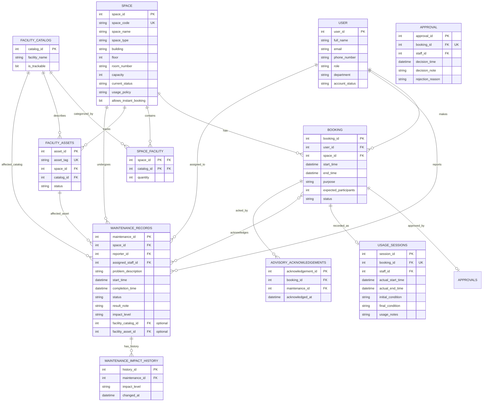

# Updated ERD and Logical Design - G11

## 1. Change-Diff Summary (vs Phase 1)

| Element | Phase 1 | Phase 2 | Status |
| :--- | :--- | :--- | :--- |
| `MAINTENANCE_RECORD.impact_level` | — | `out-of-service` / `advisory` | **ADDED** (attribute) |
| `MAINTENANCE_RECORD.facility_catalog_id` | — | optional FK | **ADDED** (attribute + relationship) |
| `MAINTENANCE_RECORD.facility_asset_id` | — | optional FK | **ADDED** (attribute + relationship) |
| `SPACE.allows_instant_booking` | — | bit | **ADDED** (attribute) |
| `ADVISORY_ACKNOWLEDGEMENT` | — | new junction entity | **ADDED** (entity) |
| `MAINTENANCE_IMPACT_HISTORY` | — | new history entity | **ADDED** (entity) |
| BR-02 (maintenance blocks booking) | unconditional | conditional on impact level | **CHANGED** |
| BR-01 (no overlap) | DELEGATED_TO_APP | DB-level concurrency control | **CHANGED** (enforcement) |
| All other entities/tables | — | unchanged | **RETAINED** |

---

## 2. Entities (Phase 2 ERD)

1. `USERS`  *(retained)*
2. `SPACES`  *(retained + 1 attribute added)*
3. `FACILITY_CATALOG` *(retained)*
4. `SPACE_FACILITY` *(retained)*
5. `FACILITY_ASSETS` *(retained)*
6. `BOOKINGS` *(retained)*
7. `APPROVALS` *(retained)*
8. `USAGE_SESSIONS` *(retained)*
9. `MAINTENANCE_RECORDS` *(retained + 1 attribute + 2 optional FKs added)*
10. `MAINTENANCE_IMPACT_HISTORY` *(ADDED)*
11. `ADVISORY_ACKNOWLEDGEMENTS` *(ADDED — associative)*

---

## 3. Relationships & Cardinalities

| Left | Relationship | Right | Cardinality | Notes |
| :--- | :--- | :--- | :--- | :--- |
| USER | makes | BOOKING | 1:N | retained |
| SPACE | has | BOOKING | 1:N | retained |
| SPACE | configured_with | SPACE_FACILITY | 1:N | retained |
| FACILITY_CATALOG | appears_in | SPACE_FACILITY | 1:N | retained |
| SPACE | tracks | FACILITY_ASSET | 1:N | retained |
| FACILITY_CATALOG | classifies | FACILITY_ASSET | 1:N | retained |
| BOOKING | results_in | APPROVAL | 1:1 | retained |
| BOOKING | results_in | USAGE_SESSION | 1:1 | retained |
| SPACE | undergoes | MAINTENANCE_RECORD | 1:N | retained (multiple active allowed) |
| USER (reporter) | reports | MAINTENANCE_RECORD | 1:N | retained |
| USER (assigned) | assigned_to | MAINTENANCE_RECORD | 1:N | retained |
| MAINTENANCE_RECORD | has_history | MAINTENANCE_IMPACT_HISTORY | 1:N | **ADDED** (identifying) |
| FACILITY_ASSET | affected_by | MAINTENANCE_RECORD | 1:0..1 | **ADDED** (optional, XOR) |
| FACILITY_CATALOG | affected_by | MAINTENANCE_RECORD | 1:0..1 | **ADDED** (optional, XOR) |
| BOOKING | acknowledges | MAINTENANCE_RECORD | **M:N** | **ADDED** → junction `ADVISORY_ACKNOWLEDGEMENTS` |

---

## 4. Mermaid ER Diagram

---

## 5. Relational Schema (Phase 2)

> Only new/changed tables and columns are fully specified below. All Phase 1 tables are retained unchanged.

### Table: `spaces` — (MODIFIED)

| Column | Data Type | Constraints & Keys |
| :--- | :--- | :--- |
| *(all Phase 1 columns retained)* | | |
| allows_instant_booking | BIT | NOT NULL DEFAULT 0 |

> Enables CH-07: space types allowed to auto-approve are flagged individually (assumption A-05).

---

### Table: `maintenance_records` (MODIFIED)

| Column | Data Type | Constraints & Keys |
| :--- | :--- | :--- |
| *(all Phase 1 columns retained)* | | |
| impact_level | NVARCHAR(20) | NOT NULL DEFAULT 'advisory' CHECK (impact_level IN ('out-of-service', 'advisory')) |
| facility_catalog_id | INT | NULL FK REFERENCES facility_catalog(catalog_id), ON UPDATE NO ACTION ON DELETE NO ACTION |
| facility_asset_id | INT | NULL FK REFERENCES facility_assets(asset_id), ON UPDATE NO ACTION ON DELETE NO ACTION |

> **XOR constraint:** a record may link to a facility type OR a specific asset OR neither. If an asset is set, its catalog must equal the value in `facility_catalog_id` (enforced by trigger in Step 10).
> **Assumption A-01:** impact level decided by Facility Staff/Manager.

---

### Table: `maintenance_impact_history` (ADDED)

| Column | Data Type | Constraints & Keys |
| :--- | :--- | :--- |
| history_id | INT | IDENTITY(1,1) PRIMARY KEY |
| maintenance_id | INT | NOT NULL, FK → maintenance_records(maintenance_id), ON UPDATE NO ACTION ON DELETE CASCADE |
| impact_level | NVARCHAR(20) | NOT NULL CHECK (impact_level IN ('out-of-service', 'advisory')) |
| changed_at | DATETIME2 | NOT NULL |

> History of escalate/downgrade (CH-04). ON DELETE CASCADE is safe here because history rows are a pure dependent log of the maintenance record (audit sub-records that must disappear with their parent).

---

### Table: `advisory_acknowledgements` (ADDED)

| Column | Data Type | Constraints & Keys |
| :--- | :--- | :--- |
| acknowledgement_id | INT | IDENTITY(1,1) PRIMARY KEY |
| booking_id | INT | NOT NULL, FK → bookings(booking_id), ON UPDATE NO ACTION ON DELETE NO ACTION |
| maintenance_id | INT | NOT NULL, FK → maintenance_records(maintenance_id), ON UPDATE NO ACTION ON DELETE NO ACTION |
| acknowledged_at | DATETIME2 | NOT NULL |

> Unique: `UNIQUE (booking_id, maintenance_id)`. One booking may acknowledge several advisories; one advisory is acknowledged by many bookings (M:N, CH-02).

---

## 6. Summary of Referential Integrity (new/changed FKs only)

| From Table | From Column | To Table | To Column | ON UPDATE | ON DELETE |
| :--- | :--- | :--- | :--- | :--- | :--- |
| maintenance_records | facility_catalog_id | facility_catalog | catalog_id | NO ACTION | NO ACTION |
| maintenance_records | facility_asset_id | facility_assets | asset_id | NO ACTION | NO ACTION |
| maintenance_impact_history | maintenance_id | maintenance_records | maintenance_id | NO ACTION | CASCADE |
| advisory_acknowledgements | booking_id | bookings | booking_id | NO ACTION | NO ACTION |
| advisory_acknowledgements | maintenance_id | maintenance_records | maintenance_id | NO ACTION | NO ACTION |

> **Rationale:** historical/audit records (acknowledgements) use NO ACTION on delete. The impact-history table is a pure log of its parent maintenance record, so CASCADE is acceptable (sub-records should not outlive the parent). Surrogate FK keys ⇒ NO ACTION on UPDATE.

---

## 7. Entity-to-Table Traceability (Phase 2)

| Entity | Table |
| :--- | :--- |
| USER | users |
| SPACE | spaces |
| FACILITY_CATALOG | facility_catalog |
| SPACE_FACILITY | space_facility |
| FACILITY_ASSET | facility_assets |
| BOOKING | bookings |
| APPROVAL | approvals |
| USAGE_SESSION | usage_sessions |
| MAINTENANCE_RECORD | maintenance_records |
| MAINTENANCE_IMPACT_HISTORY | maintenance_impact_history |
| ADVISORY_ACKNOWLEDGEMENT | advisory_acknowledgements |

---

## 8. Business Rule Enforcement (Phase 2)

| Rule | Enforcement |
| :--- | :--- |
| Out-of-service maintenance blocks overlapping booking | Query/logic in concurrency-controlled booking procedure (Step 12) that rejects when overlapping `out-of-service` maintenance exists. |
| Advisory maintenance → notify + ack | Required rows in `advisory_acknowledgements` created at booking time; enforced in booking procedure (Step 12). |
| No overlapping approved bookings (concurrency-safe) | Pessimistic locking transaction + overlap check (Step 12). |
| Impact level escalation reflected | `maintenance_impact_history` appended; affected-booking query updates booking space status (Step 12 / Step 16). |

---

## 9. Conversion Notes

- **M:N for advisory ack:** Resolved via junction `advisory_acknowledgements`.
- **XOR facility link:** enforced by trigger (Step 10) — a record may target asset OR catalog OR neither, and an asset's catalog must match.
- **Surrogate keys:** all new tables use `INT IDENTITY(1,1)`; natural keys remain UNIQUE where applicable.
- **Enum gaps:** `impact_level` uses exact Phase 2 wording. Maintenance `status` enumeration remains open (OQ in Step 8 → OQ-01).