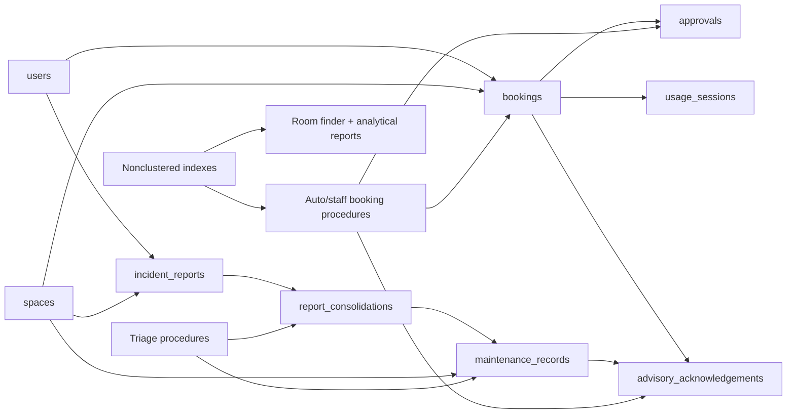
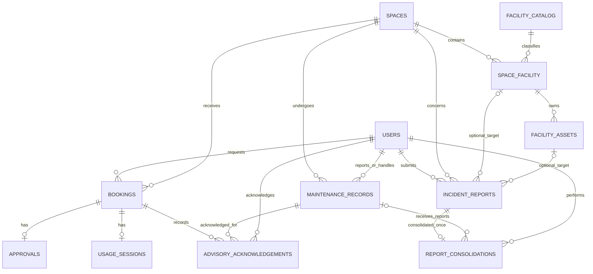
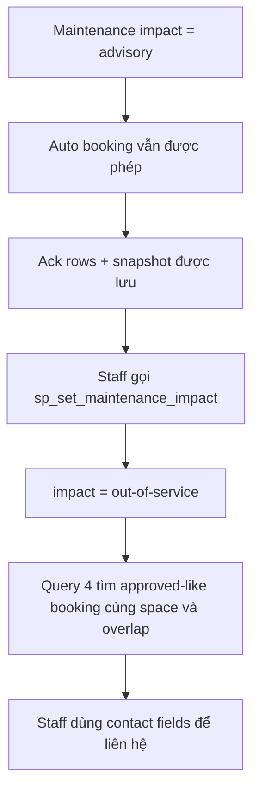

# Phase 2 Implementation & Oral Defense Guide — G11

> Mục đích: tài liệu ôn tập và bảo vệ đồ án dựa trên **implementation hiện tại** của Campus Space Management System. Đây không phải đặc tả thiết kế mới. Khi tài liệu cũ khác code, phần giải thích này ưu tiên schema/procedure/script SQL đang thực sự chạy.

## Cách dùng tài liệu

- Đọc mục 1–6 để nắm luồng tổng thể và ERD.
- Học kỹ mục 8–10 trước khi demo concurrency.
- Học kỹ mục 11–17 trước khi demo indexing.
- Dùng mục 23–27 để luyện trả lời miệng.
- Khi giáo viên yêu cầu chỉ code, dùng bảng traceability cuối tài liệu để mở đúng file.

### Thứ tự nguồn sự thật đã đối chiếu

1. Yêu cầu: `req/business-requirement.md`, `CS486_Project_Phase01.md`, `CS486_Project_Phase02.md`.
2. Schema vật lý: `outputs/05-db-definition-G11.sql` rồi migration `outputs/10-schema-migration-G11.sql`.
3. Hành vi giao dịch: `outputs/12-concurrency-implementation-G11.sql`.
4. Bằng chứng chạy: task 13, task 14, task 15 và `outputs/16-analytical-queries-G11.sql`.
5. Các file thiết kế/báo cáo 08, 09, 11, 15 dùng để giải thích ý định, nhưng code đang chạy được ưu tiên nếu có khác biệt.

### Các khác biệt phải biết trước khi bảo vệ

Đây là các điểm cần trả lời trung thực, không nên nói quá khả năng của code:

1. `outputs/09-updated-erd-and-logical-design-G11.md` gọi `REPORT_CONSOLIDATION` là quan hệ M:N. Schema thật có `UNIQUE(incident_report_id)`, nên mỗi incident report có tối đa một consolidation; nhiều report có thể trỏ tới cùng một maintenance. Quan hệ vật lý là **N:1 từ report tới maintenance**, với bảng liên kết lưu metadata triage.
2. Logical design nói `facility_assets` được “re-pointed” và thay thế `space_id/catalog_id`. Migration thực tế **thêm** `space_facility_id` nhưng vẫn giữ hai cột và FK Phase 1. Dữ liệu generator đồng bộ cả ba, nhưng schema chưa có constraint bắt cặp cũ phải khớp facility instance mới.
3. Folder task 13 hiện chỉ có demo giải pháp an toàn. Không có script executable riêng tạo double-booking “unsafe”. Phần unsafe trong guide là timeline/đoạn code khái niệm, không được giới thiệu như một file hiện có.
4. `sp_AutoApproveBookingRequest` kiểm tra cờ auto-booking, trạng thái phòng, capacity, conflict và maintenance. Nó không parse nội dung tự do trong `spaces.usage_policy`; điều kiện purpose trong procedure chủ yếu lặp lại miền giá trị đã được `CHECK` của `bookings` bảo vệ.
5. `sp_set_maintenance_impact` cập nhật impact của record tồn tại nhưng không kiểm tra `maintenance_records.status` có đang mở hay không, và tự nó không trả danh sách booking bị ảnh hưởng. Danh sách đó nằm ở Query 4 của file 16.
6. Benchmark tự động đối chiếu `result_count`; biến checksum được tính nhưng không lưu. Vì vậy bằng chứng tự động là “số dòng không đổi + integrity validations”, không phải so sánh byte-to-byte toàn bộ result set.
7. Header file 16 dùng nhãn RC-07..RC-10 cho bốn report, trong khi file 08 dùng RC-07/RC-08 cho các thay đổi khác. Khi bảo vệ, nên gọi report bằng **tên business question**, không dựa vào các số RC bị lệch này.

---

# 1. Phase 2 overview

## 1.1 Phase 1 làm gì?

Phase 1 xây dựng database cho người dùng, không gian, facility, asset, booking, approval, usage session và maintenance. Schema đã có PK/FK/UNIQUE/CHECK và lưu lịch sử, nhưng ba quy tắc quan trọng vẫn được ghi là `DELEGATED_TO_APP`:

- Không có hai approved booking chồng thời gian trên cùng phòng.
- Không booking phòng không khả dụng/đang maintenance.
- Rejected booking phải có rejection reason.

Điểm thiếu lớn là phép `SELECT kiểm tra → INSERT/UPDATE` chưa có cơ chế chống hai transaction chạy đồng thời.

## 1.2 Phase 2 bổ sung gì?

- Phân maintenance thành `advisory` và `out-of-service`.
- Lưu acknowledgement theo từng cặp booking–maintenance.
- Cho phép auto-approval bằng `spaces.auto_booking_enabled`.
- Thêm incident report và quy trình gộp report trùng vào maintenance.
- Chuyển facility trong phòng thành một instance có surrogate key.
- Đưa booking/approval vào stored procedure có transaction và locking.
- Sinh 150.000 booking trong hơn ba năm để test tải.
- Thêm bốn báo cáo nghiệp vụ.
- Tạo và benchmark bốn index tuning chính.

## 1.3 Luồng kiến trúc mức cao



Ý nghĩa: maintenance là nguồn quyết định phòng bị chặn; incident report chỉ là dữ liệu đầu vào chờ triage. Booking và approval phải đi qua cùng quy tắc conflict. Index không thay đổi business result, mà giúp transaction và report tìm đúng tập dữ liệu với ít page reads hơn.

---

# 2. So sánh Phase 1 → Phase 2

| Area | Phase 1 | Phase 2 hiện tại | Implementation |
|---|---|---|---|
| Maintenance | `spaces.current_status` có `Under Maintenance`; maintenance chưa có mức ảnh hưởng | Bỏ trạng thái đó khỏi domain; thêm `maintenance_records.impact_level` | Migration sections 1 và 7 |
| Advisory | Không có | Advisory không block; booking lưu flag, snapshot và từng acknowledgement row | `bookings`, `advisory_acknowledgements`, auto procedure |
| OOS maintenance | Mô tả chung “maintenance blocks” | Chỉ record `out-of-service` chồng thời gian mới block | Hai booking procedures và Room Finder |
| Incident intake | Không có | Report theo room/facility/asset, sau đó consolidate | `incident_reports`, `report_consolidations` |
| Facility model | `space_facility` có composite PK; asset trỏ thẳng space/catalog | Thêm `space_facility_id`, asset thêm FK tới instance | Migration section 3 |
| Booking | Chủ yếu là dữ liệu và application logic | Auto-booking có cờ opt-in, capacity check, maintenance/conflict check | `sp_AutoApproveBookingRequest` |
| Approval | `staff_id NOT NULL` | `staff_id NULL` biểu diễn automatic approval | Migration section 6 |
| Concurrency | Không có database workflow thống nhất | Explicit transaction, `UPDLOCK`, `HOLDLOCK`, per-space serialization | Output 11–13 |
| Reporting | Các query Phase 1 tổng quát | Bốn report bắt buộc Phase 2 | Output 16 |
| Data volume | 24 sample bookings | Thêm 150.000 deterministic bookings | Output 14 |
| Indexing | PK/UNIQUE và một số index cơ bản sau migration | Bốn index được đo Before/After có script tái lập | Output 15 demo/report |

## Vì sao Phase 1 không còn đủ?

Một `CHECK` constraint chỉ nhìn được giá trị của row đang ghi, nên không thể diễn đạt đơn giản “không row booking nào khác cùng space chồng interval”. FK chỉ xác nhận ID cha tồn tại. Transaction nếu không khóa đúng serialization point vẫn cho phép hai session cùng đọc “không có conflict”. Phase 2 vì vậy cần cả **mô hình dữ liệu mới**, **business transaction** và **index hỗ trợ truy cập/locking**.

---

# 3. Updated ERD — mô hình thực tế cần hiểu

## 3.1 ERD khái quát theo physical schema



Lưu ý: Mermaid trên thể hiện cardinality vật lý. `maintenance_id` trong consolidation nullable, nên một consolidation row về mặt schema có thể chưa trỏ maintenance; procedure hiện tại thường ghi non-null.

## 3.2 Giải thích từng entity quan trọng

### `users` — retained

- PK: `user_id INT IDENTITY`.
- Candidate key: `email`, được `UQ_users_email` bảo vệ.
- Thuộc tính chính: `full_name`, `phone_number`, `role`, `department`, `account_status`.
- `role` có CHECK sáu vai trò. `account_status` default `Active` nhưng không có CHECK domain.
- Một user có thể tạo nhiều booking, report maintenance/incident, approve, consolidate và acknowledge.

### `spaces` — changed

- PK: `space_id`; candidate key: `space_code` unique.
- Lưu loại phòng, vị trí, capacity, trạng thái và policy.
- `current_status` Phase 2 chỉ còn `Available`, `In Use`, `Temporarily Closed`, `Retired`.
- `auto_booking_enabled BIT NOT NULL DEFAULT 0` là opt-in an toàn: migration không tự bật auto-booking cho dữ liệu cũ.
- Maintenance không còn được suy ra chỉ từ một trạng thái trên room, vì một room có thể đồng thời có nhiều maintenance với impact khác nhau.

### `facility_catalog` — retained

- PK `catalog_id`.
- `facility_name`, `is_trackable` mô tả loại thiết bị/facility.
- Không có UNIQUE trên `facility_name`; code demo dùng `MIN(catalog_id)` khi tra Projector/AC để xử lý khả năng trùng tên.

### `space_facility` — changed

- PK mới: `space_facility_id INT IDENTITY`.
- Natural candidate key vẫn được giữ bằng `UNIQUE(space_id, catalog_id)`.
- Hai FK xác định facility type nào có trong space nào; `quantity >= 0`.
- Việc thêm surrogate key cho phép incident nhắm tới “Projector trong room X” như một object duy nhất, thay vì phải mang cặp khóa khắp nơi.

### `facility_assets` — changed nhưng còn legacy columns

- PK `asset_id`; candidate key `asset_tag` unique.
- FK mới bắt buộc `space_facility_id → space_facility`.
- Unique index `(space_facility_id, asset_id)` làm referenced key cho composite FK của incident.
- Physical table vẫn còn `space_id`, `catalog_id` và hai FK Phase 1. Đây là redundancy cần nhớ; generator ghi các giá trị khớp nhau nhưng DB chưa có constraint kiểm tra ba đường tham chiếu nhất quán.

### `bookings` — changed

- PK `booking_id`; FK bắt buộc tới requester (`user_id`) và room (`space_id`).
- `CK_bookings_chrono`: `end_time > start_time`.
- `purpose` và `status` có domain CHECK.
- Phase 2 thêm `advisory_acknowledged BIT DEFAULT 0` và `advisory_snapshot NVARCHAR(MAX)`.
- Snapshot là bằng chứng nội dung người dùng đã nhìn thấy tại thời điểm booking; normalized ack rows là bằng chứng từng advisory cụ thể.

### `approvals` — changed

- PK `approval_id`; `booking_id` vừa FK vừa UNIQUE, nên một booking có tối đa một approval row.
- `staff_id` nullable: NULL nghĩa là automatic approval; manual approval truyền user ID.
- `rejection_reason` nullable ở schema. Quy tắc rejected phải có reason vẫn là logic/validation liên bảng, chưa thành một constraint đơn giản.

### `usage_sessions` — retained

- PK `session_id`; `booking_id` UNIQUE FK tạo cardinality booking 0..1 usage session.
- Các trường check-in/out nullable theo lifecycle; chronological CHECK áp dụng khi có đủ giá trị.

### `maintenance_records` — changed

- PK `maintenance_id`; mỗi row bắt buộc thuộc một space và có reporter; assigned staff optional.
- `impact_level NOT NULL DEFAULT 'advisory'` với CHECK chỉ cho `advisory`, `out-of-service`.
- `completion_time NULL` nghĩa là interval còn mở.
- `status` vẫn là free text vì yêu cầu gốc không liệt kê domain; code dùng các giá trị như `Reported`, `Open`, `In Progress`, `Completed`.

`impact_level` phù hợp làm attribute vì nó là phân loại thay đổi được của **mỗi maintenance record**, không phải trạng thái duy nhất của room. Tách advisory/OOS thành hai tables sẽ nhân đôi cấu trúc và làm escalation phải chuyển row; đặt Boolean trên `spaces` lại không biểu diễn được nhiều maintenance đồng thời. Escalation hiện được biểu diễn bằng UPDATE chính attribute này.

### `incident_reports` — new

- PK `report_id`; bắt buộc `user_id`, `space_id`, description, time, status.
- Target facility và asset là optional.
- `CHECK(asset_id IS NULL OR space_facility_id IS NOT NULL)` cấm asset mà không nêu facility instance.
- Composite FK `(space_facility_id, asset_id)` bảo đảm asset thuộc instance được chọn.
- Schema chưa bảo đảm `incident_reports.space_id` khớp space nằm trong `space_facility_id`; đây là integrity gap vật lý cần biết.

### `report_consolidations` — new

- PK `consolidation_id`.
- `incident_report_id UNIQUE` nghĩa là một report chỉ được consolidate một lần.
- `maintenance_id` nullable theo schema, nhưng procedure tạo/reuse maintenance rồi ghi ID.
- `consolidated_by` và `consolidated_at` lưu audit triage.
- Nhiều report có thể có cùng `maintenance_id`: đây là cách gom duplicate report vào một work item.

### `advisory_acknowledgements` — new

- PK `acknowledgement_id`.
- Ba FK: `booking_id`, `maintenance_id`, `acknowledged_by`.
- `UNIQUE(booking_id, maintenance_id)` bảo đảm một booking chỉ acknowledgement một advisory cụ thể một lần.
- Một booking có thể có nhiều ack; một maintenance có thể được nhiều booking acknowledge. Đây là quan hệ N:M được resolve đúng bằng associative table có metadata `acknowledged_by/at`.

## 3.3 Cardinality nói bằng lời

| Quan hệ | Cách giải thích khi nói |
|---|---|
| User 1 — N Booking | Một user có thể gửi nhiều booking; mỗi booking có đúng một requester. |
| Space 1 — N Booking | Một room có lịch sử nhiều booking; mỗi booking chỉ dành cho một room. |
| Booking 1 — 0..1 Approval | Pending có thể chưa có approval; UNIQUE FK ngăn hai quyết định cho cùng booking. |
| Booking 1 — 0..1 Usage Session | Booking chưa check-in có thể chưa có session; một booking tối đa một session. |
| Space N — M Facility Catalog | Được resolve qua `space_facility`; quantity thuộc chính cặp room–facility. |
| Space Facility 1 — N Asset | Một facility instance có thể gồm nhiều asset vật lý; mỗi asset có một `space_facility_id`. |
| Space 1 — N Maintenance | Một room có thể có nhiều maintenance đồng thời và khác impact. |
| User/Space 1 — N Incident | Mỗi report có một reporter và room; một user/room có thể có nhiều report. |
| Incident 1 — 0..1 Consolidation | Report mở có thể chưa triage; UNIQUE ngăn consolidate hai lần. |
| Maintenance 1 — 0..N Consolidation | Một maintenance có thể gom nhiều report; maintenance có thể được tạo trực tiếp nên có thể không có report. |
| Booking N — M Maintenance | Resolve qua acknowledgement; mỗi cặp chỉ một row nhưng mỗi phía có thể tham gia nhiều cặp. |

## 3.4 Tại sao acknowledgement phải là bảng riêng?

Một Boolean duy nhất trên maintenance không trả lời được **booking nào**, **người nào**, **advisory nào**, **lúc nào** đã được thông báo. Một Boolean duy nhất trên booking cũng không đủ vì một booking có thể chồng ba advisory và sau đó một advisory thứ tư được thêm.

Thiết kế hiện tại dùng hai lớp:

- `bookings.advisory_acknowledged/advisory_snapshot`: đọc nhanh và giữ nội dung snapshot.
- `advisory_acknowledgements`: audit normalized theo từng `(booking_id, maintenance_id)`.

Ví dụ: booking B10 chồng maintenance M3 “projector lỗi” và M7 “một AC lỗi”. Procedure tạo hai ack rows `(B10,M3)` và `(B10,M7)`, đặt flag = 1, rồi nối mô tả vào snapshot. Nếu M3 sau đó escalated, ack cũ không bị xóa: nó chứng minh trạng thái thông tin tại lúc booking; Query 4 tìm B10 để staff liên hệ.

## 3.5 Maintenance escalation theo dữ liệu thật



Escalation không tự cancel booking vì yêu cầu nói “identify so staff can contact requesters”. Code file 16 join maintenance → bookings → users → spaces để trả tên/email/phone/department. Demo của Query 4 tạo một maintenance advisory trong outer transaction, gọi procedure nâng impact, query booking bị ảnh hưởng, rồi rollback nên database không bị bẩn.

---

# 4. Relational schema và integrity constraints

## 4.1 Integrity được cấu trúc bảo vệ

| Loại | Ví dụ thật | Business rule được bảo vệ |
|---|---|---|
| PRIMARY KEY | `bookings.booking_id`, `maintenance_records.maintenance_id` | Mỗi entity row có identity duy nhất. |
| FOREIGN KEY | `bookings.space_id → spaces.space_id` | Không có booking trỏ phòng không tồn tại. |
| UNIQUE | `users.email`, `spaces.space_code`, `facility_assets.asset_tag` | Natural identifiers không trùng. |
| UNIQUE FK | `approvals.booking_id`, `usage_sessions.booking_id` | Booking có tối đa một approval/session. |
| Composite UNIQUE | `(space_id,catalog_id)`; `(booking_id,maintenance_id)` | Không lặp facility type trong room; không ack cùng advisory hai lần. |
| CHECK domain | booking purpose/status, role, incident status, maintenance impact | Chặn giá trị ngoài miền đã biết. |
| CHECK time/value | `end_time > start_time`, `capacity > 0`, `quantity >= 0` | Chặn interval/capacity/quantity vô lý. |
| DEFAULT | impact `advisory`, auto flag `0`, incident status `Open` | Dữ liệu mới có trạng thái an toàn nếu caller bỏ qua cột. |
| Trigger | `TRG_ValidateFacilityQuantity` | Quantity của loại trackable không vượt số physical assets đã đăng ký. |

`NO ACTION` trên phần lớn FK giữ lịch sử: không thể xóa user/space đang được booking, maintenance hay report tham chiếu. Migration cũng đổi `space_facility` từ composite PK sang surrogate PK nhưng giữ natural pair bằng UNIQUE.

## 4.2 Integrity cần transaction/business logic

Không thể dùng ordinary row CHECK để kiểm tra hiệu quả các quy tắc sau vì chúng cần đọc row/table khác:

- Hai approved-like bookings cùng room không overlap.
- Booking không overlap out-of-service maintenance.
- Advisory overlap phải tạo đủ acknowledgement rows và snapshot.
- Rejected booking phải có approval row chứa rejection reason.
- Manual approver phải có vai trò được phép.
- Incident `space_id` phải khớp room của facility instance.

Project xử lý hai quy tắc overlap trong stored procedures. Generator/validation kiểm tra advisory và rejection trên fixture. Tuy nhiên role của approver và incident-space matching chưa được procedure/constraint hiện tại bảo đảm đầy đủ.

## 4.3 Nullability có chủ đích

- `approvals.staff_id NULL`: automatic decision, không phải “mất dữ liệu”.
- `maintenance_records.assigned_staff_id`, `completion_time`, `result_note` NULL: record có thể chưa assign/chưa hoàn tất.
- `incident_reports.space_facility_id`, `asset_id` NULL: room-level report hợp lệ.
- `report_consolidations.maintenance_id NULL`: schema cho phép trạng thái chờ triage, dù procedure hiện dùng maintenance ID khi insert.
- `bookings.expected_participants NULL`: schema cho phép chưa biết; nếu có thì CHECK > 0 và auto procedure so với capacity.
- Các trường usage session NULL theo lifecycle.

## 4.4 Các constraint không nên nói quá

- FK không chống overlap; nó chỉ chống orphan ID.
- Transaction không tự động chống race; phải có đúng locks/serialization point.
- `advisory_acknowledged=1` không tự chứng minh đủ ack rows; unique/FK bảo vệ hình dạng row, còn completeness được procedure và validation đảm nhiệm.
- `maintenance_records.status` không có CHECK, nên không được nói DB bắt buộc một state machine maintenance.
- `spaces.usage_policy` là text, chưa có policy engine trong SQL.

---

# 5. Normalization và 3NF — đánh giá trung thực

## 5.1 Khái niệm ngắn gọn

- **1NF:** mỗi ô chứa một giá trị thuộc domain và mỗi row nhận diện được. Không dùng repeating columns như `facility1`, `facility2`.
- **2NF:** đã 1NF và không có non-key attribute phụ thuộc chỉ một phần của composite candidate key.
- **3NF:** đã 2NF và không có non-key attribute phụ thuộc bắc cầu qua non-key attribute khác. Dạng kiểm tra thường dùng: với mọi FD `X → A`, X là superkey hoặc A là prime attribute.
- **Partial dependency:** `(space_id,catalog_id) → quantity` nhưng quantity chỉ phụ thuộc `space_id`; nếu vậy sẽ vi phạm 2NF. Trong project quantity thực sự thuộc cả cặp nên không vi phạm.
- **Transitive dependency:** `asset_id → space_facility_id → space_id,catalog_id`; nếu cả ba cùng lưu mà không có lý do/constraint phù hợp, đó là redundancy 3NF.

## 5.2 Functional dependencies chính

| Relation | Candidate key(s) | FD quan trọng |
|---|---|---|
| `users` | `user_id`, `email` | Mỗi key → name, phone, role, department, status. |
| `spaces` | `space_id`, `space_code` | Mỗi key → toàn bộ mô tả room và auto flag. |
| `facility_catalog` | `catalog_id` | `catalog_id → facility_name,is_trackable`. `facility_name` không được constraint unique. |
| `space_facility` | `space_facility_id`; `(space_id,catalog_id)` | Mỗi candidate key → quantity. |
| `facility_assets` | `asset_id`, `asset_tag` | Mỗi candidate key → status và ba location references; intended `space_facility_id → space_id,catalog_id` làm lộ redundancy vật lý. |
| `bookings` | `booking_id` | booking ID → requester, room, interval, purpose, status, advisory snapshot/flag. |
| `approvals` | `approval_id`, `booking_id` | Mỗi key → staff, time, note, reason. |
| `usage_sessions` | `session_id`, `booking_id` | Mỗi key → staff và lifecycle data. |
| `maintenance_records` | `maintenance_id` | ID → space/reporter/assignee/problem/interval/status/impact. |
| `incident_reports` | `report_id` | ID → reporter, room, optional target, description, time, status. |
| `report_consolidations` | `consolidation_id`, `incident_report_id` | Mỗi key → optional maintenance, actor, time. |
| `advisory_acknowledgements` | `acknowledgement_id`; `(booking_id,maintenance_id)` | Mỗi key → acknowledged_by, acknowledged_at. |

## 5.3 Phần đã normalize tốt

- Space–facility M:N được tách thành `space_facility`, vì quantity là thuộc tính của quan hệ.
- Booking approval và usage lifecycle được tách, tránh hàng loạt nullable columns trong booking và giữ cardinality 0..1 bằng UNIQUE FK.
- Booking–advisory N:M được tách thành acknowledgement table; actor/time phụ thuộc đúng cặp acknowledgement.
- Duplicate incidents không copy nguyên maintenance vào report; consolidation giữ liên kết/audit.
- Natural key và surrogate key cùng được bảo vệ ở `space_facility`.

## 5.4 Controlled denormalization

`bookings.advisory_snapshot` là text snapshot có thể chứa nhiều mô tả. Không nên dùng nó để join/report từng advisory; normalized source là `advisory_acknowledgements`. Snapshot được giữ có chủ ý để audit đúng nội dung hiển thị ở thời điểm booking, kể cả maintenance sau này đổi mô tả/impact.

## 5.5 Physical-schema gaps so với tuyên bố “tất cả 3NF”

Không nên trả lời tuyệt đối rằng physical schema hiện tại hoàn toàn 3NF:

1. `facility_assets` còn `space_id`, `catalog_id`, `space_facility_id`. Theo intended semantics, `space_facility_id → space_id,catalog_id`; do đó có dependency bắc cầu và khả năng update anomaly. Hơn nữa chưa có constraint buộc legacy values khớp instance. Logical target trong file 09 là bỏ hai cột cũ, nhưng migration chưa làm.
2. `incident_reports` bắt buộc `space_id` đồng thời có optional `space_facility_id`. Nếu target facility được chọn, room có thể suy ra từ facility instance, nhưng schema không enforce hai giá trị khớp. Đây vừa là redundancy theo intended rule, vừa là integrity gap.
3. Validation task 14 kiểm tra orphan và asset-instance matching, nhưng chưa kiểm tra hai mismatch nêu trên. “38 checks đều 0” là bằng chứng dataset hợp lệ theo các check đã viết, không phải chứng minh hình thức rằng mọi relation ở 3NF.

**Câu trả lời defense an toàn:** “Logical design hướng tới 3NF và phần lớn relations đạt 3NF. Tuy nhiên physical additive migration giữ legacy `facility_assets.space_id/catalog_id`, nên hiện còn controlled/unfinished redundancy. Nếu hoàn thiện migration, nhóm sẽ backfill, kiểm tra consistency, cập nhật trigger/query rồi mới drop hai legacy FK/columns.”

---

# 6. Schema migration theo thứ tự chạy

Nguồn: `outputs/10-schema-migration-G11.sql`.

## Bước 1 — thêm và backfill impact level

1. Thêm `maintenance_records.impact_level` nullable để legacy rows không làm ALTER thất bại.
2. Backfill NULL/blank thành `advisory`.
3. Thêm default, đổi `NOT NULL`, thêm CHECK hai giá trị.

Mẫu **add nullable → backfill → tighten** là cách an toàn hơn việc thêm ngay NOT NULL không có dữ liệu cho row cũ.

## Bước 2 — migrate `Under Maintenance`

- Với mỗi legacy space đang `Under Maintenance`, migration tạo một OOS maintenance record nếu chưa có.
- Sau đó đổi room status thành `Temporarily Closed`.
- Cuối migration, old anonymous CHECK được drop và `CK_spaces_current_status` được tạo lại không chứa `Under Maintenance`.

Điều này bảo toàn hành vi block của dữ liệu cũ. Script giả định Phase 1 có ít nhất một Facility Manager/Staff để làm reporter/assignee; sample file 06 đáp ứng giả định.

## Bước 3 — thêm các cột workflow

- `spaces.auto_booking_enabled BIT NOT NULL DEFAULT 0`.
- `bookings.advisory_acknowledged BIT NOT NULL DEFAULT 0`.
- `bookings.advisory_snapshot NVARCHAR(MAX) NULL`.

Defaults làm dữ liệu Phase 1 vẫn hợp lệ và không tự động bật tính năng mới.

## Bước 4 — facility-instance normalization

1. Thêm identity `space_facility_id`.
2. Drop old composite PK, tạo clustered PK mới trên identity.
3. Giữ `(space_id,catalog_id)` bằng UNIQUE.
4. Thêm `facility_assets.space_facility_id` nullable.
5. Tạo missing `space_facility` row cho asset Phase 1 `PHONE-001-MTG` nếu cần.
6. Backfill, đổi NOT NULL, thêm FK.

Đây là migration bảo toàn dữ liệu, nhưng không hoàn toàn “additive only” theo nghĩa literal vì nó drop/recreate constraint PK và status CHECK. Nó không drop table hay xóa row Phase 1.

`TRG_ValidateFacilityQuantity` vẫn đếm asset bằng legacy `(space_id,catalog_id)`, là một lý do code hiện chưa thể drop hai cột cũ mà không cập nhật trigger.

## Bước 5 — tạo ba bảng Phase 2

- `incident_reports` cùng CHECK/FKs/default.
- `report_consolidations` cùng unique report và audit FKs.
- `advisory_acknowledgements` cùng unique booking-maintenance.

## Bước 6 — asset target integrity

Unique index `UQ_facility_assets_instance_asset(space_facility_id,asset_id)` tạo unique referenced key hợp lệ cho SQL Server. Nó không phải candidate key tối thiểu vì `asset_id` riêng đã là PK. Composite FK từ incident buộc asset đúng facility instance. CHECK bổ sung cấm asset nếu facility instance NULL.

## Bước 7 — automatic approval

`approvals.staff_id` đổi nullable nhưng FK vẫn giữ. Existing manual approvals không mất dữ liệu; auto approval mới ghi NULL.

## Bước 8 — index cho workload mới

Migration tạo bảy support indexes:

- `IX_bookings_space_time`
- `IX_bookings_status_time`
- `IX_maintenance_records_space_time`
- `IX_incident_reports_space_status`
- `IX_consolidations_maintenance`
- `IX_advisory_ack_booking`
- `IX_spaces_capacity_status`

Task 15 cố ý drop bốn index tuning đầu/cuối có liên quan benchmark để tạo baseline Before, sau đó tạo lại đúng definition.

---

# 7. Concurrency — từ business race đến TOCTOU

Nguồn thiết kế: `outputs/11-concurrency-design-G11.md`. Implementation authoritative: `outputs/12-concurrency-implementation-G11.sql`.

## 7.1 Race condition không cần SQL phức tạp vẫn xảy ra

Hai user cùng yêu cầu một phòng, hai interval overlap:

| Time | Transaction A | Transaction B |
|---|---|---|
| T1 | Kiểm tra availability | |
| T2 | Không thấy booking conflict | Kiểm tra availability |
| T3 | | Cũng không thấy conflict vì A chưa commit |
| T4 | Insert Approved B1 | |
| T5 | | Insert Approved B2 |
| T6 | Commit | Commit |

Mỗi transaction tự nhìn thấy “đúng” tại thời điểm SELECT, nhưng kết quả toàn hệ thống sai: hai approved bookings cùng room chồng thời gian.

## 7.2 TOCTOU trong project

TOCTOU = **Time Of Check To Time Of Use**:

```sql
IF NOT EXISTS (SELECT 1 FROM dbo.bookings WHERE ...overlap...)
BEGIN
    INSERT dbo.bookings (..., status) VALUES (..., 'Approved');
END
```

Khoảng giữa SELECT và INSERT là cửa sổ race. `IF NOT EXISTS` chỉ cho biết snapshot/committed state mà statement đó thấy; nó không tự “đặt chỗ” cho absence vừa đọc. Một transaction thông thường chỉ nhóm thao tác atomic khi commit/rollback; isolation/locks mới quyết định session khác có được thực hiện check xung đột đồng thời hay không.

## 7.3 Overlap predicate bắt buộc nhớ

```sql
existing.start_time < requested_end
AND existing.end_time > requested_start
```

Đây là half-open interval `[start,end)`. Hai booking 10:00–11:00 và 11:00–12:00 **không overlap**, vì `existing.end_time > requested_start` trở thành `11:00 > 11:00`, false. Dùng `BETWEEN` thường dễ sai boundary.

## 7.4 Các khái niệm lock trong đúng project này

| Khái niệm | Ý nghĩa trong implementation |
|---|---|
| Transaction | Gói check maintenance, check conflict, insert/update booking và approval thành một đơn vị. |
| READ COMMITTED | Isolation mặc định. Không có database-wide SERIALIZABLE/SNAPSHOT setting trong code. |
| Shared lock (S) | SELECT thường dùng để đọc committed data; S lock đơn thuần không đủ giữ “ý định ghi” tới cuối transaction. |
| Update lock (U) | `UPDLOCK` yêu cầu U lock khi đọc row/key chuẩn bị thay đổi/serialize. Hai U locks trên cùng resource không tương thích, nên chỉ một session thắng. |
| Exclusive lock (X) | INSERT/UPDATE lấy X lock; session khác không thể đọc/ghi theo compatibility tương ứng cho tới release. |
| `HOLDLOCK` | Tương đương SERIALIZABLE cho table reference đó; giữ key/range protection tới hết transaction, chống phantom trong range probe. |
| Key/range lock | Probe booking/maintenance trên index có thể bảo vệ key/range tìm kiếm, kể cả “khoảng trống” cần chống insert phantom. |
| `ROWLOCK` | Yêu cầu ưu tiên row granularity; không phải lời hứa tuyệt đối vì SQL Server có thể chọn/escalate lock. |
| Blocking | B chờ A nhả resource; sau commit B tiếp tục và thấy state mới. Đây là hành vi mong muốn trong demo. |
| Deadlock | A chờ B trong khi B chờ A; SQL Server chọn một victim 1205 để phá vòng. S8 chấp nhận victim an toàn nếu invariant cuối đúng. |
| Commit | Làm thay đổi visible và nhả locks của outer transaction. |
| Rollback | Hủy mọi thay đổi trong transaction và nhả locks. |

## 7.5 Serialization point thực sự

Điểm mạnh nhất của hai booking paths không chỉ là range hint. Cả hai đều lấy:

```sql
SELECT ...
FROM dbo.spaces WITH (UPDLOCK, ROWLOCK)
WHERE space_id = @space_id;
```

Room row là mutex ở database theo `space_id`. Hai booking cùng room phải lần lượt qua U lock này, kể cả interval không overlap. Booking ở hai room khác nhau khóa hai rows khác nhau nên vẫn chạy song song. Đây là trade-off: correctness đơn giản và chắc cho cùng room, nhưng serialize hơi rộng hơn mức chỉ khóa interval.

---

# 8. Exact concurrency solution — walkthrough code

## 8.1 Mẫu transaction chung

```sql
SET XACT_ABORT ON;
BEGIN TRY
    BEGIN TRAN;
    -- lock, validate, write
    COMMIT TRAN;
END TRY
BEGIN CATCH
    IF XACT_STATE() <> 0 ROLLBACK TRAN;
    THROW;
END CATCH;
```

- `XACT_ABORT ON`: nhiều runtime errors làm transaction bị abort thay vì để transaction dang dở.
- TRY/CATCH bảo đảm rollback khi còn active/uncommittable và giữ nguyên lỗi bằng `THROW`.
- Locks được giữ tới `COMMIT/ROLLBACK` của transaction ngoài cùng.

## 8.2 `sp_AutoApproveBookingRequest`

### Block 1 — lock và đọc room

Procedure lấy U lock trên `spaces` row, đọc `current_status`, auto flag, capacity và policy. Nếu room không tồn tại hoặc status không thuộc `Available/In Use`, procedure rollback và báo lỗi.

**Tại sao cần lock trước?** Nó khiến mọi auto/staff approval cùng room dùng một hàng đợi chung. Nếu chỉ đọc thường, hai session có thể cùng qua room check.

### Block 2 — out-of-service probe

```sql
IF EXISTS (
    SELECT 1
    FROM dbo.maintenance_records WITH (UPDLOCK, HOLDLOCK)
    WHERE space_id = @space_id
      AND impact_level = 'out-of-service'
      AND start_time < @end_time
      AND (completion_time IS NULL OR completion_time > @start_time)
)
```

- `space_id` equality thu hẹp một room.
- `start_time < end requested` và completion > start requested là overlap.
- NULL completion được coi là chưa kết thúc.
- Advisory bị loại nên không block.
- `UPDLOCK,HOLDLOCK` giữ candidate keys/range tới cuối transaction.

Nếu bỏ probe, booking có thể được approved trong electrical repair. Nếu bỏ transactional protection, maintenance có thể đổi trong cửa sổ check–insert.

### Block 3 — approved-booking conflict probe

```sql
IF EXISTS (
    SELECT 1
    FROM dbo.bookings WITH (UPDLOCK, HOLDLOCK)
    WHERE space_id = @space_id
      AND status IN ('Approved','Checked In','Completed')
      AND start_time < @end_time
      AND end_time > @start_time
)
```

Statuses ở đây là “approved-like occupying”. `Pending`, `Rejected`, `Cancelled`, `No-show` không block trong procedures. Room U lock đã serialize cùng room; range hints là thêm protection cho probe và phantom.

### Block 4 — policy checks thực tế

- Auto flag phải bằng 1.
- Nếu participant count được cung cấp, nó không vượt capacity.
- Purpose phải thuộc bảy giá trị booking đã biết.

Không nên nói procedure hiểu câu tự do trong `usage_policy`; nó chỉ đọc text và kiểm tra purpose theo domain cố định khi policy không NULL.

### Block 5 — write booking, advisory audit và approval

1. Insert booking với status `Approved`.
2. Tìm mọi advisory cùng room overlap interval.
3. Insert một row acknowledgement cho mỗi maintenance.
4. Set flag và `STRING_AGG` snapshot.
5. Insert approval với `staff_id=NULL`, note auto-approved.
6. Commit và trả booking ID/status.

Tất cả cùng transaction: không thể commit booking mà thiếu approval do lỗi ở bước cuối. Tuy vậy advisory SELECT không có explicit lock hint; kết hợp với việc impact update procedure không lấy room lock tạo ra một vùng hành vi chưa được chứng minh đầy đủ nếu advisory escalates đúng lúc auto booking đang ghi ack.

## 8.3 `sp_book_space_staff_approve`

### Block 1 — lock pending booking

Procedure lấy U lock bằng PK `booking_id`, đọc room và interval, rồi yêu cầu status đúng `Pending`. Hai staff approve **cùng một booking** sẽ serialize ở row này; người thứ hai sau khi chờ thấy `Approved`, không còn Pending.

### Block 2 — lock room và chạy cùng hai probes

Sau booking row, procedure lấy U lock trên room, kiểm tra status, OOS maintenance và approved conflict bằng cùng overlap/hints như auto path. Việc dùng chung room serialization point là lý do instant vs staff và staff vs staff không tạo double-booking.

### Block 3 — update và audit

- Update booking thành `Approved`.
- Insert approval với `staff_id=@staff_id` và decision note.
- Commit.

**Giới hạn:** staff procedure không tạo advisory acknowledgements/snapshot. Code hiện chỉ tự động thực hiện BR-11 trong auto-booking path và generator. Quy trình submission của pending booking không được thể hiện bằng một procedure riêng, nên không thể khẳng định từ code rằng mọi manual workflow thực tế luôn acknowledgement advisory.

## 8.4 `sp_consolidate_incident_reports`

Input là chuỗi comma-separated IDs. Procedure:

1. Dùng `UPDLOCK,HOLDLOCK` tìm selected reports đang `Open`.
2. Nếu không còn open, phân biệt `ALREADY_CONSOLIDATED` và `NO_OPEN_REPORTS`.
3. Kiểm tra link đã tồn tại.
4. Nếu caller không đưa maintenance ID, tạo một advisory maintenance dựa trên space của report đầu.
5. Insert tất cả selected open reports vào consolidation cùng một maintenance.
6. Update report status thành `Consolidated` và commit.

`UQ_consolidations_incident` là defense-in-depth: nếu race vẫn insert hai link cho một report, unique constraint chặn một bên.

**Giới hạn:** `CHARINDEX` trên chuỗi ID không SARGable và procedure không xác nhận mọi ID thuộc cùng space trước khi gom. Với lab nhỏ nó chạy được, nhưng TVP và same-space validation sẽ tốt hơn trong production.

## 8.5 `sp_set_maintenance_impact`

- Chỉ nhận `advisory` hoặc `out-of-service`.
- Bắt đầu transaction, update row theo maintenance ID, báo lỗi nếu không tồn tại.
- Commit và trả ID/impact.

Procedure không kiểm tra maintenance đang open, không lấy `spaces` serialization row và không tự chạy affected-booking query. Trong S7, **session test bên ngoài** chủ động lock room và maintenance row trước khi gọi procedure; vì vậy demo S7 mạnh hơn bản thân procedure độc lập.

## 8.6 Lock order và lock lifetime

- Auto: space → maintenance range → booking range → insert booking/ack/approval.
- Staff: pending booking → space → maintenance range → booking range → update/approval.
- Locks do `UPDLOCK` và writes được giữ tới outer commit/rollback.
- Trong SQL Server, nested `BEGIN TRAN` không commit độc lập. Demo Session A mở outer transaction rồi gọi procedure; inner `COMMIT` chỉ giảm `@@TRANCOUNT`, locks vẫn còn tới outer `COMMIT`.

## 8.7 Concurrency và index liên hệ thế nào?

`IX_bookings_space_time(space_id,start_time,end_time)` cho optimizer đi trực tiếp tới keys của một room và start-time range. Nhờ vậy:

- ít pages/keys phải đọc;
- range protection thường hẹp hơn so với clustered scan;
- transaction giữ lock trong thời gian ngắn hơn;
- giảm khả năng lock escalation và blocking không liên quan.

Nhưng index **không tự tạo invariant**. Correctness chính đến từ mọi booking path đi qua transaction và cùng room lock. Không có index, logic vẫn có thể đúng nhưng scan/locking rộng và chậm hơn. Nếu một application chèn thẳng `Approved` row ngoài procedures, schema không có exclusion constraint để chặn nó.

---

# 9. Cách hiểu và demo task 13

## 9.1 Unsafe demonstration — chỉ là mô hình, không có file chạy hiện tại

Một unsafe Session A/B sẽ đều chạy plain `IF NOT EXISTS` không `UPDLOCK`, không room serialization, chờ nhau rồi insert approved. Execution order khái niệm:

1. A bắt đầu và check thấy free.
2. Trước khi A insert/commit, B check cũng thấy free.
3. A insert; B insert; cả hai commit.
4. Query self-join overlap thấy hai rows.

Folder hiện tại không cung cấp script này. Khi giáo viên hỏi “unsafe là gì?”, giải thích timeline; không nói `01/02` là unsafe vì chúng đang gọi safe procedures.

Pseudocode minh họa, **không phải script có sẵn và không chạy trong demo chính**:

```sql
-- Session A, conceptual unsafe path
BEGIN TRAN;
IF NOT EXISTS (SELECT 1 FROM dbo.bookings WHERE ...overlap...)
BEGIN
    WAITFOR DELAY '00:00:05';
    INSERT dbo.bookings (...,status) VALUES (...,'Approved');
END;
COMMIT;
```

```sql
-- Session B starts during A's WAITFOR, using the same plain check
BEGIN TRAN;
IF NOT EXISTS (SELECT 1 FROM dbo.bookings WHERE ...same overlap...)
    INSERT dbo.bookings (...,status) VALUES (...,'Approved');
COMMIT;
```

Vì plain SELECT không giữ per-space/range protection, cả hai có thể pass trước writes.

## 9.2 Chuẩn bị demo thật

1. Chạy `00-setup-concurrency-lab-G11.sql`.
2. Mở Window A và B trong SSMS.
3. Chạy toàn bộ `01-run-all-session-A-G11.sql` ở A.
4. Khi A in `SESSION A READY`, chạy toàn bộ `02-run-all-session-B-G11.sql` ở B.
5. Chờ cả hai complete; chạy `03-verify-all-G11.sql`.
6. Kết quả cuối phải là `ALL 8 SCENARIOS PASS`.

Không chạy từng đoạn chọn lọc vì `WAITFOR` và thứ tự scenario đã được căn để A lấy lock trước.

## 9.3 Safe demo chi tiết nhất — S3 auto vs auto

### Session A

- Mở outer transaction.
- Lấy `UPDLOCK,HOLDLOCK` trên row `CONC-RACE`.
- In tín hiệu rồi chờ 10 giây.
- Gọi auto procedure cho 09:00–11:00.
- Outer commit; log `APPROVED`.

### Session B

- Gọi auto procedure cho 10:00–12:00 cùng room.
- B dừng tại room U lock vì A đang giữ incompatible lock.
- Khi A commit, B tiếp tục, chạy conflict probe và thấy booking 09:00–11:00.
- B rollback/error; test chuyển thành log `OVERLAP`.

### Final state

Chính xác một Approved booking overlap window 09:00–12:00. Đây là bằng chứng “blocking rồi re-check”, không phải B bị bỏ qua ngẫu nhiên.

## 9.4 Tám scenario và invariant

| Scenario | Race/business case | Expected state |
|---|---|---|
| S1 advisory | Advisory cùng interval | Booking Approved, flag=1, snapshot và ack row có mặt. |
| S2 OOS | OOS cùng interval | Không booking row được để lại; log `OUT_OF_SERVICE`. |
| S3 auto–auto | Hai auto requests overlap | A Approved, B `OVERLAP`, đúng một survivor. |
| S4 auto–staff | Auto và pending staff overlap | Auto thắng; pending vẫn Pending; staff `OVERLAP`. |
| S5 staff–staff | Hai pending bookings khác nhau overlap | A Approved; booking B vẫn Pending. |
| S6 double approval | Hai staff approve cùng booking | Một approval row; B thấy `NOT_PENDING`. |
| S7 escalation–approval | Advisory escalates trong khi approval chạy | Test orchestration cho escalation thắng; booking vẫn Pending; B thấy OOS. |
| S8 consolidation | Hai triage cùng hai reports | Hai report links nhưng chỉ một distinct maintenance. Loser `ALREADY_CONSOLIDATED` hoặc safe deadlock victim. |

## 9.5 Blocking và deadlock trong output

- S3–S7 dùng blocking có chủ đích. Session B “đứng” vài giây không phải treo; nó đang chờ A commit.
- S8 có nhiều resources/report rows nên SQL Server có thể chọn winner khác nhau hoặc phát hiện deadlock. Verifier không giả định A luôn thắng; nó kiểm tra invariant cuối và đúng một `CONSOLIDATED`.
- `SAFE_DEADLOCK_REJECT` chỉ hợp lệ vì victim rollback toàn bộ và verifier xác nhận dữ liệu không double-consolidate.

---

# 10. Concurrency viva — câu hỏi và câu trả lời mẫu

### Q: Tại sao transaction bình thường chưa đủ?

Transaction tạo atomic unit nhưng READ COMMITTED không tự khóa absence/range tới lúc insert. Hai transaction vẫn có thể cùng check “free”. Project thêm U lock trên room và `UPDLOCK,HOLDLOCK` cho probes.

### Q: Tại sao `IF NOT EXISTS` chưa đủ?

Nó chỉ trả lời state nhìn thấy lúc check. Nếu không giữ lock ngăn transaction khác thay đổi state liên quan, kết quả có thể stale trước INSERT/UPDATE.

### Q: Tại sao chọn targeted hints thay vì `SET TRANSACTION ISOLATION LEVEL SERIALIZABLE` toàn transaction?

Hints áp dụng vào serialization/probe cần thiết, tránh nâng mọi read như user/policy thành serializable. Tuy nhiên project còn dùng per-space row lock, nên cùng room vẫn serialize khá rộng.

### Q: `UPDLOCK` khác X lock?

U lock là ý định cập nhật khi đọc, cho phép tránh pattern nhiều shared readers cùng nâng lên X. Khi write thật, SQL Server chuyển/lấy X. Hai U trên cùng resource không tương thích.

### Q: `HOLDLOCK` làm gì?

Nó cho table reference semantics SERIALIZABLE và giữ key/range locks đến transaction end, giúp chống phantom row xuất hiện trong range vừa kiểm tra.

### Q: Hai request không overlap thì sao?

Nếu cùng room, implementation vẫn lần lượt qua room U lock rồi request thứ hai được approve sau khi re-check thấy không overlap. Nếu khác room, chúng có thể chạy đồng thời.

### Q: Locks được nhả khi nào?

Khi outermost transaction commit/rollback. Inner procedure commit trong demo không nhả outer locks.

### Q: Blocking khác deadlock?

Blocking là chờ một chiều và tự giải phóng khi owner commit. Deadlock là vòng chờ; SQL Server phải rollback một victim.

### Q: Có thể deadlock không?

Có. Short transaction/lock order giảm nguy cơ chứ không loại bỏ. S8 đã quan sát khả năng 1205 và xử lý victim an toàn; application production nên có retry policy cho deadlock phù hợp.

### Q: Instant approval và staff approval đồng thời được bảo vệ thế nào?

Cả hai lock cùng `spaces.space_id`, rồi chạy cùng maintenance/booking overlap predicate trong transaction. Winner commit; loser tiếp tục và thấy state mới nên reject.

### Q: Tại sao bảo vệ ở database thay vì chỉ application?

Database là điểm chung của mọi client/service và nơi commit invariant. App-only mutex dễ bị bỏ qua bởi client khác hoặc nhiều app instances; direct SQL vẫn là caveat nếu không thu hồi quyền insert trực tiếp.

### Q: Application lock (`sp_getapplock`) có thể thay thế không?

Có thể dùng resource như `space:<id>`, nhưng implementation hiện không dùng. Row/key locks gắn trực tiếp với dữ liệu và transaction, không cần naming convention bổ sung.

### Q: Index có làm race biến mất không?

Không. Index chỉ giúp tìm/khóa hiệu quả hơn. Nếu vẫn check rồi insert không serialization, seek nhanh chỉ làm race nhanh hơn.

### Q: S7 có chứng minh mọi escalation production an toàn không?

Không hoàn toàn. Test S7 outer-lock room và maintenance trước khi gọi impact procedure. `sp_set_maintenance_impact` độc lập không lấy room lock/status-open check, nên chỉ nên nói test chứng minh orchestrated flow đó.

### Q: Nếu procedure error sau khi insert booking nhưng trước approval?

`XACT_ABORT`, TRY/CATCH và rollback hủy toàn transaction; không còn orphan booking do lần gọi đó.

### Q: Có cách nào bypass invariant?

Có nếu caller có quyền INSERT/UPDATE trực tiếp `bookings` thành Approved. Thiết kế vận hành nên grant EXECUTE procedure và hạn chế direct DML; repo hiện không có permission script này.

---

# 11. Indexing — trực giác và cấu trúc SQL Server

## 11.1 Trực giác

Không có index phù hợp, SQL Server có thể phải đọc phần lớn clustered booking rows để tìm vài booking của một room. Có index phù hợp, engine điều hướng tới vùng keys bắt đầu bằng `space_id` hoặc `status/start_time`, rồi chỉ đọc phần nhỏ hơn.

Index không đổi result và không thay constraint. Nó là cấu trúc truy cập phụ được duy trì cùng table.

## 11.2 B+tree intuition

SQL Server rowstore index được hiểu như B+tree:

- **Root page:** điểm bắt đầu, giữ key ranges và pointer xuống dưới.
- **Intermediate pages:** chia nhỏ khoảng key.
- **Leaf level:** chứa sorted index keys; nonclustered leaf còn chứa included columns và clustered key làm row locator.
- **Seek:** đi root → branch → leaf tới một key/range phù hợp.
- **Scan:** đi qua nhiều/all leaf pages theo thứ tự.

Seek không mặc định tốt hơn scan. Nếu query cần 60% table, một sequential scan trên index hẹp có thể rẻ hơn hàng vạn seeks/lookups.

## 11.3 Clustered và nonclustered trong project

- Các integer PK được SQL Server tạo clustered vì table chưa có clustered index khác. Ví dụ `bookings` được sắp vật lý ở leaf clustered theo `booking_id`.
- UNIQUE constraints như `spaces.space_code`, `approvals.booking_id` tạo nonclustered unique indexes.
- Bốn tuned indexes đều là nonclustered; chúng không đổi clustered storage của base table.
- `INCLUDE` đưa output/filter columns vào leaf mà không làm chúng thành navigation key.

Ví dụ, `IX_bookings_space_time` chứa status ở leaf. Query có thể hoàn thành conflict test từ index, không cần Key Lookup về clustered booking row cho status. `INCLUDE(status)` không cho seek trực tiếp bằng status trong index này.

---

# 12. Composite indexes và column order thực tế

## 12.1 Leftmost-prefix rule

Index `(A,B,C)` được sort trước theo A, trong mỗi A theo B, rồi trong mỗi `(A,B)` theo C. Nó không tương đương `(C,B,A)`. Equality trên leading keys thường cho phép tiếp tục seek; khi gặp range trên B, C thường không thể tạo một independent seek range hiệu quả và có thể thành residual predicate.

## 12.2 Bốn tuned indexes

### `IX_bookings_space_time(space_id, start_time, end_time) INCLUDE(status)`

- `space_id` là equality và phân vùng logic theo room.
- `start_time < @end` tạo range trong room.
- Sau range trên start, `end_time > @start` thường là residual; B-tree một chiều không giải hoàn hảo bài toán interval bằng hai independent inequalities.
- `status` included để cover approved-like filter.
- Dùng cho conflict probe và booking anti-probe trong Room Finder.

Nếu đảo thành `start_time,space_id,...`, global time range có thể trộn 400 rooms và làm per-room locking/search kém tập trung.

### `IX_bookings_status_time(status, start_time, end_time) INCLUDE(space_id)`

- Reporting bắt đầu với ba equality/IN status values.
- Trong mỗi status, `start_time >= start AND < end` là range.
- `end_time` có trong leaf/key để tính duration nhưng sau start range không tiếp tục seek độc lập.
- `space_id` included cover join/group theo space ở hours report.
- Weekday/hour report tái sử dụng index dù không cần `space_id`, tránh tạo thêm index gần giống.

Nếu `start_time` đứng trước status, time range vẫn dùng được nhưng engine không tách sớm approved-like rows. Nếu `space_id` đứng trước, semester report toàn hệ thống thiếu equality cho leading key.

### `IX_maintenance_records_space_time(space_id,start_time,completion_time) INCLUDE(impact_level,status)`

- Room Finder/procedure tìm maintenance theo một `space_id`.
- `start_time < requested_end` tạo range.
- `completion_time IS NULL OR > requested_start` và `impact_level='out-of-service'` là residual/leaf filters.
- INCLUDE giúp không lookup base row để đọc impact/status.

Đưa `impact_level` vào key trước time có thể giúp equality, nhưng chỉ có hai values (selectivity thấp) và primary access pattern vẫn là per-room interval. Project chọn coverage thay vì làm key rộng hơn.

### `IX_spaces_capacity_status(capacity,current_status) INCLUDE(space_type,space_name)`

- `capacity >= @MinCapacity` là leading range.
- `current_status NOT IN (...)` đứng sau range nên khả năng seek thêm bị hạn chế; status cũng ít distinct values.
- INCLUDE hỗ trợ một phần projection, nhưng không cover `space_code/building/floor/room_number`.
- Với chỉ 408 spaces, optimizer thực tế vẫn scan clustered `spaces` 17 reads. Không được quy phần cải thiện 99% của Room Finder cho index này.

## 12.3 Ba support indexes khác trong migration

| Index | Tại sao order như vậy? |
|---|---|
| `IX_incident_reports_space_status(space_id,status) INCLUDE(user_id,reported_at)` | Triage/staff thường chọn một room rồi trạng thái report; hai equality keys đứng trước, output audit ở leaf. |
| `IX_consolidations_maintenance(maintenance_id) INCLUDE(incident_report_id,consolidated_at)` | Điều hướng từ maintenance tới tất cả source reports; maintenance equality là leading key. |
| `IX_advisory_ack_booking(booking_id) INCLUDE(maintenance_id,acknowledged_at)` | Mở booking history rồi lấy mọi advisory đã ack mà không lookup. |

## 12.4 Composite UNIQUE indexes có ý nghĩa integrity

- `UQ_space_facility_space_catalog(space_id,catalog_id)`: vừa chống duplicate vừa hỗ trợ Room Finder kiểm tra một required facility trong một room.
- `UQ_acknowledgements_booking_maint(booking_id,maintenance_id)`: một ack/cặp; order ưu tiên lookup theo booking.
- `UQ_facility_assets_instance_asset(space_facility_id,asset_id)`: unique referenced key cho composite FK; không phải minimal candidate key vì `asset_id` đã unique.
- `UQ_consolidations_incident(incident_report_id)`: chống một incident được consolidate hai lần.

---

# 13. Booking conflict index — giải thích sâu

## 13.1 Query thực tế

```sql
SELECT 1
FROM dbo.bookings WITH (UPDLOCK, HOLDLOCK)
WHERE space_id = @space_id
  AND status IN ('Approved','Checked In','Completed')
  AND start_time < @end_time
  AND end_time > @start_time;
```

Mapping predicate → index:

| Predicate | Vai trò |
|---|---|
| `space_id=@space_id` | Seek equality trên key 1. |
| `start_time<@end_time` | Seek/range boundary trên key 2. |
| `end_time>@start_time` | Residual interval test sau start range. |
| `status IN (...)` | Residual từ included leaf column; không lookup. |

Một normal B-tree sắp theo một thứ tự lexicographic; nó không thể đồng thời sắp interval theo cả start và end để mọi overlap thành một contiguous range nhỏ. Index vẫn rất hiệu quả vì loại gần như toàn bộ room khác và nhiều future starts trước khi residual evaluation.

## 13.2 Plan và số đo

- Before: `Clustered Index Scan`, trung bình 1.994 logical reads.
- After: `Index Seek`, 6 logical reads.
- Giảm 99,70%; result `1=1`.
- Estimated cost giảm 0,0172718 → 0,00329291 (80,93%).

Benchmark cố ý chọn conflict muộn ở `GEN-0400` để baseline scan không dừng sớm. Elapsed after dưới độ phân giải timer, nên report để N/A thay vì tuyên bố một phần trăm thời gian giả.

---

# 14. Room Finder — query pipeline và indexes

## 14.1 Năm tầng điều kiện

```text
capacity/status candidate
        ↓
có TẤT CẢ required facilities
        ↓
không có approved-like booking overlap
        ↓
không có out-of-service maintenance overlap
        ↓
return room một lần
```

| Tầng | Table/index |
|---|---|
| Capacity/status | `spaces`; candidate index `IX_spaces_capacity_status` nhưng plan fixture vẫn clustered scan. |
| Required facilities | `space_facility`; unique `(space_id,catalog_id)` hỗ trợ inner lookup. |
| Booking availability | `bookings`; `IX_bookings_space_time`. |
| Maintenance availability | `maintenance_records`; `IX_maintenance_records_space_time`. |

## 14.2 Tại sao double `NOT EXISTS` nghĩa là ALL?

```sql
AND NOT EXISTS (
  SELECT 1 FROM @RequiredFacilities rf
  WHERE NOT EXISTS (
    SELECT 1 FROM dbo.space_facility sf
    WHERE sf.space_id=s.space_id
      AND sf.catalog_id=rf.catalog_id
  )
)
```

Đọc bằng lời: “Không tồn tại required facility nào mà room lại thiếu.” Nếu list rỗng, không có item bị thiếu nên điều kiện true. Một join với `IN` đơn giản chỉ chứng minh room có **ít nhất một** requested facility, tức ANY, không phải ALL.

Code kiểm tra existence của mapping, không kiểm tra `quantity>0`. Với generator, Projector=1 và AC=2 nên không khác kết quả; trong dữ liệu khác, row quantity 0 vẫn được coi là present.

## 14.3 Số đo và nguồn cải thiện

- Parameters: capacity 170; Projector + Air Conditioner; 2024-06-04 11:00–12:00.
- Result: 44 rooms trước và sau.
- Logical reads trung bình: 106.861 → 690,33, giảm 99,35%.
- CPU: 3.194,33 ms → 13,33 ms.
- Elapsed: 3.197,582 ms → 13,333 ms.
- Estimated cost: 0,569239 → 0,0626523.

Visible `STATISTICS IO` cho thấy nguồn cải thiện thật:

| Table | Before reads | After reads |
|---|---:|---:|
| `bookings` | 102.306 | 255 |
| `maintenance_records` | 4.206 | 104 |
| `space_facility` | 180 | 180 |
| required-facility temp table | 91 | 91 |
| `spaces` | 17 | 17 |

Do đó booking/maintenance scans → seeks mới là nguyên nhân chính; space/facility reads không đổi.

---

# 15. Hai analytical indexes được benchmark

## 15.1 Approved hours per space

Business question: mỗi room có bao nhiêu approved-like bookings và tổng bao nhiêu giờ trong window.

- Query LEFT JOIN từ spaces để kể cả room 0 usage.
- Filter status/time nằm trong JOIN để không biến LEFT JOIN thành INNER JOIN.
- Duration dùng `DATEDIFF(MINUTE)/60.0`.
- Benchmark window 2023-01-01 → 2026-02-01 bao gần toàn fixture.

Plan summary trong report:

- Before: clustered scan + hash aggregate.
- After: nonclustered index scan + stream aggregate summary.
- Reads 2.011 → 594 (70,46%).
- Elapsed 352,755 → 161,884 ms (54,11%).
- Cost 2,4357 → 0,767761.

Tại sao after vẫn scan? Window rộng và statuses lấy 90.000/150.000 GEN bookings. Scan một covering nonclustered index hẹp hợp lý hơn rất nhiều random navigation/lookups. “Scan” ở đây không đồng nghĩa plan xấu.

## 15.2 Approved bookings by weekday/hour

- Filter status và time trước.
- `DATEPART` chỉ tính sau filter để group weekday/hour.
- Công thức dùng `@@DATEFIRST` để chuẩn hóa Monday=1..Sunday=7.
- Benchmark trả 35 groups ở cả hai phase.

Plan summary:

- Before: clustered scan + hash aggregate.
- After: index seek + hash aggregate.
- Reads 2.006 → 589 (70,64%).
- Elapsed 289,452 → 97,943 ms (66,16%).
- Cost 2,27083 → 0,59239.

Query tái sử dụng `IX_bookings_status_time`, nên không trả thêm storage/write cost cho một index thứ ba trên bookings.

---

# 16. Execution plans và SARGability

## 16.1 Đọc operator theo ngữ cảnh

| Operator | Cách hiểu đúng |
|---|---|
| Clustered Index Scan | Đọc nhiều leaf pages của base clustered table. Hợp lý nếu cần tỷ lệ row lớn; đắt cho per-room lookup trên 150k rows. |
| Index Scan | Đọc nhiều pages của nonclustered index. Có thể tốt vì index hẹp/covering hơn base rows. |
| Index Seek | Điều hướng tới key/range. Tốt khi selective, nhưng nhiều seeks + lookups vẫn có thể đắt. |
| Key Lookup | Lấy cột thiếu từ clustered row cho từng match. Rẻ với vài rows, rất đắt nếu lặp hàng chục nghìn lần. INCLUDE có thể loại lookup. |
| Nested Loops | Hợp khi outer nhỏ và inner có seek tốt; Room Finder candidate spaces thường phù hợp pattern này. Kế hoạch thật có thể đổi theo stats. |
| Hash Match | Hợp với input lớn/không có useful order; cần memory và có thể spill nếu estimate sai. |
| Merge Join | Cần hai input ordered theo join key; tốt cho tập lớn đã sort. Không nên khẳng định plan hiện tại dùng nó nếu chưa nhìn actual plan. |
| Sort | Tạo order cho ORDER BY/group/merge; tốn CPU/memory, có thể spill tempdb. |
| Hash/Stream Aggregate | Hash không cần input ordered; Stream tận dụng/order sau sort và thường ít memory hơn. |
| Filter | Áp residual predicate chưa dùng làm seek condition, ví dụ end-time/impact. |

Repo không lưu `.sqlplan`; report lưu main operator/cost summary. Khi demo phải bật Ctrl+M và chỉ đúng operator trong plan live thay vì học thuộc một plan có thể đổi theo SQL Server/stats.

## 16.2 SARGability trong project

SARGable predicate cho phép optimizer dùng ordered index để hình thành search argument.

Tốt:

```sql
b.space_id = @space_id
AND b.start_time < @end_time
AND b.end_time > @start_time

b.start_time >= @SemStart
AND b.start_time < @SemEnd
```

`DATEPART` trong weekday report không nằm ở WHERE, nên time range vẫn seekable. Pattern xấu tương ứng sẽ là `WHERE YEAR(start_time)=2025`, vì function trên indexed column thường buộc compute cho nhiều rows; project không dùng pattern này ở filter benchmark.

Các residual/khó seek cần hiểu:

- Sau range trên `start_time`, inequality trên `end_time` thường residual.
- `completion_time IS NULL OR completion_time>@ReqStart` là OR và đứng sau start range.
- `current_status NOT IN (...)` ít selective và đứng sau capacity range.
- `CHARINDEX` comma-list trong consolidation không SARGable; đó không phải workload benchmark.
- `COALESCE` trên maintenance completion trong Query 4 là phần overlap report, không phải tuned Room Finder predicate.

## 16.3 Seek không luôn thắng

Nếu report lấy gần toàn 150k bookings, một index scan đọc 594 pages có thể tốt hơn seek nhiều ranges rồi lookup. Optimizer chọn cost tổng, không chọn operator theo nhãn “seek tốt/scan xấu”. Statistics và parameter values quyết định crossover.

---

# 17. Before/After benchmark — con số đến từ đâu?

## 17.1 Dataset

Sau `00-prepare-index-demo-G11.sql`:

- 150.000 `GEN-*` bookings + 24 Phase 1 = 150.024 total.
- 400 generated spaces + 8 Phase 1 = 408.
- 4.000 generated maintenance + 8 total Phase 1/migration = 4.008.
- 530 advisory acknowledgement rows.
- Date coverage GEN: 2023-01-02 08:00 → 2026-01-16 19:00.
- Không có CONC/legacy IDX fixture trong benchmark.

Preparation drop đúng bốn tuned indexes, giữ clustered PK, UNIQUE và các support indexes khác, rồi `UPDATE STATISTICS ... WITH FULLSCAN`.

## 17.2 Cách đo

Mỗi phase chạy:

1. Run 0 warm-up, không lưu.
2. Runs 1–3 identical, warm cache.
3. `logical_reads` và `cpu_time` lấy delta từ `sys.dm_exec_requests` của chính `@@SPID`.
4. Elapsed đo bằng `SYSUTCDATETIME()` và `DATEDIFF_BIG(MICROSECOND,...)`.
5. Averages lưu ở `dbo.index_benchmark_results_G11`.
6. `STATISTICS IO/TIME` in chi tiết Room Finder; actual plan bật bằng Ctrl+M.

Physical reads bằng 0 trong displayed warm-cache runs: data pages đã ở buffer pool. Logical read là số lần SQL Server truy cập page 8 KB trong buffer pool; cùng page có thể được đọc logic nhiều lần trong nested execution. Vì vậy logical reads ổn định hơn elapsed time và phản ánh work của plan tốt hơn trong demo.

## 17.3 Bảng kết quả verified

| Query | Before reads | After reads | Giảm reads | Before elapsed | After elapsed | Result count |
|---|---:|---:|---:|---:|---:|---:|
| Conflict | 1.994,00 | 6,00 | 99,70% | 46,332 ms | <1 ms | 1 = 1 |
| Room Finder | 106.861,00 | 690,33 | 99,35% | 3.197,582 ms | 13,333 ms | 44 = 44 |
| Hours/space | 2.011,00 | 594,00 | 70,46% | 352,755 ms | 161,884 ms | 408 = 408 |
| Weekday/hour | 2.006,00 | 589,00 | 70,64% | 289,452 ms | 97,943 ms | 35 = 35 |

Ý nghĩa:

- Conflict và Room Finder cải thiện rất lớn vì per-room scans biến thành narrow seeks.
- Hai reports vẫn xử lý hàng chục nghìn rows để aggregate, nên gain thấp hơn nhưng covering index leaf hẹp giảm I/O.
- Result counts bằng nhau cho thấy index không làm thay đổi số dòng. Validation còn kiểm tra fixture invariant và mọi query đều giảm average reads.
- Script không persist full result digest; đây là giới hạn của correctness comparison tự động.

## 17.4 Estimated cost không phải milliseconds

Estimated subtree cost là đơn vị nội bộ optimizer để so plan candidates, dựa trên cardinality/statistics/model CPU-I/O. Không được đọc `0.06` như `0.06 ms`. Actual elapsed chịu cache, CPU scheduling, parallelism và load máy.

## 17.5 Tại sao cần 150.000 rows?

Với 100 rows, cả table thường nằm trong vài pages; scan có thể nhanh ngang seek và timer noise lớn hơn công việc thật. 150k rows làm khác biệt số pages rõ ràng nhưng vẫn đủ ngắn cho live demo. Dataset deterministic giúp cùng query/result giữa lần chạy.

## 17.6 Vì sao indexing không miễn phí?

- Storage verified xấp xỉ: booking conflict index 7,56 MB; reporting booking index 7,50 MB; maintenance 0,29 MB; spaces 0,06 MB.
- Mỗi INSERT booking phải thêm leaf entry vào hai booking indexes.
- UPDATE key/status có thể sửa index; DELETE phải xóa entries.
- Page split/fragmentation và statistics/index maintenance cần được quản lý khi dữ liệu lớn.
- Một “huge index mọi column” làm leaf rộng, cache kém và DML đắt.

Bốn index được biện minh vì phục vụ correctness-critical conflict/room availability và hai report bắt buộc, trong khi Query 4 tái sử dụng index Q3 để tránh duplicate.

## 17.7 Indexing viva

### Q: Tại sao conflict index bắt đầu bằng `space_id`?

Vì mọi conflict probe là một room cụ thể. Equality leading key bỏ toàn bộ rooms khác trước khi scan start-time range và phù hợp per-space locking.

### Q: Tại sao `end_time` không giải hết overlap seek?

Sau range trên `start_time`, B-tree order không tạo independent contiguous range theo `end_time`; engine đọc candidate starts rồi residual-test end.

### Q: Tại sao status là INCLUDE trong conflict index?

Để cover filter mà không tăng key width/order. Đổi lại status không phải seek key trong index này.

### Q: Tại sao reporting index đặt status trước time?

Queries chọn approved-like statuses và semester range. Engine có thể xử lý các status key ranges rồi time ranges; included space supports join Q3.

### Q: INCLUDE khác key column?

Key tham gia sort/navigation và giới hạn key size; INCLUDE chỉ ở leaf để cover output/filter, giảm lookup mà không thay key order.

### Q: Covering index là gì?

Index chứa đủ columns để query hoàn thành mà không quay về clustered row. Hai booking indexes được thiết kế cover các target probes/reports.

### Q: Index Seek luôn nhanh hơn Scan?

Không. Seek lấy nhiều rows kèm lookup có thể đắt; Q3 scan covering index là lựa chọn hợp lý cho broad window.

### Q: Tại sao elapsed có thể thay đổi?

Cache, CPU load, compile, parallelism và OS scheduling. Vì vậy project warm-up, lặp ba lần và ưu tiên logical reads.

### Q: Logical reads có phải disk reads?

Không. Nó là buffer-pool page accesses; physical reads mới là disk. Warm benchmark có physical=0 nhưng work logic vẫn khác rất lớn.

### Q: Tại sao Room Finder tăng nhanh nhất?

Before lặp booking/maintenance scans cho candidate spaces. After inner anti-probes seek theo each space/time, giảm bookings 102.306→255 reads và maintenance 4.206→104.

### Q: Tại sao space index không được chọn?

408 rooms quá nhỏ và index không cover toàn projection. Clustered scan 17 pages rẻ; đo đạc cho thấy reads spaces không đổi.

### Q: Tại sao không đảo `(capacity,current_status)`?

Capacity là range chính; status dùng `NOT IN` và low cardinality nên cũng không phải leading equality tốt. Current index là candidate cho growth, nhưng plan fixture chứng minh không nên overclaim.

### Q: Tại sao không index mọi cột?

Mỗi index tiêu thụ storage/cache và làm chậm DML. Chỉ index workload quan trọng có predicate/order rõ và kiểm chứng bằng plan/reads.

### Q: Index ảnh hưởng concurrency thế nào?

Narrow seek/range thường đọc và khóa ít keys/pages hơn, rút ngắn transaction. Correctness vẫn do procedure/locks, không do index riêng lẻ.

### Q: Nếu lên hàng triệu bookings?

Lợi ích per-room/report indexes thường lớn hơn, nhưng phải kiểm tra cardinality, partition/retention, parameter sensitivity, fragmentation và write overhead bằng workload thật.

### Q: Benchmark có công bằng không?

Cùng fixture, predicates, warm-up, ba runs, fullscan stats và chỉ khác bốn indexes. Hạn chế là warm-cache single-session, result comparison chủ yếu count và không đại diện write-heavy multiuser production.

---

# 18. Data generator — task 14

Nguồn: `outputs/14-data-generator-G11/01-generate-data-G11.sql`, `validation.sql`, `summary.sql`.

## 18.1 Tại sao dùng set-based T-SQL?

Generator hiện thuần SQL Server, không cần Python/pyodbc. Các CTE number sets và công thức modulo sinh hàng loạt rows trong một transaction. Nếu bất kỳ verification nào fail, toàn bộ reset/insert GEN rollback.

Rerun xóa rows `GEN-*` theo FK-safe reverse order và hai generator users. Natural content deterministic; identity IDs có thể tăng sau rerun vì DELETE không reseed identity.

## 18.2 Thứ tự sinh và dependencies

1. Xóa acknowledgements/consolidations/sessions/approvals/incidents/bookings/maintenance/assets/mappings/spaces/users cũ.
2. Tạo requester và staff generator.
3. Bảo đảm catalog Projector/AC tồn tại.
4. Tạo 400 spaces.
5. Tạo 800 `space_facility` rows.
6. Projector quantity tạm 0 → tạo 400 asset → update quantity 1, để trigger Phase 1 không chặn chicken-and-egg.
7. Tạo maintenance trước booking.
8. Tạo 150.000 bookings.
9. Gắn snapshot + 530 acknowledgements cho các time overlaps.
10. Tạo approvals, usage sessions, incidents và consolidations.
11. Fail-fast check count/overlap/OOS invariant rồi commit.

## 18.3 Dữ liệu thực tế đã đo

| Thành phần GEN | Count |
|---|---:|
| Spaces | 400 |
| Facility mappings | 800 |
| Assets | 400 |
| Bookings | 150.000 |
| Approvals | 105.000 |
| Usage sessions | 30.000 |
| Maintenance records | 4.000 |
| Incident reports | 400 |
| Consolidations | 200 |
| Advisory acknowledgements | 530 |

Space types gần đều: 66–67 mỗi loại; capacity từ 30 đến 170; 200 rooms auto-enabled và 200 disabled. Mỗi room có Projector quantity 1 và AC quantity 2.

Booking status distribution:

| Status | Count |
|---|---:|
| Approved | 60.000 |
| Checked In | 15.000 |
| Completed | 15.000 |
| No-show | 15.000 |
| Pending | 15.000 |
| Rejected | 15.000 |
| Cancelled | 15.000 |

Purposes gần đều khoảng 21.428–21.429 mỗi loại. Có 30.000 approval rows với `staff_id=NULL` theo fixture.

Calendar distribution: 50.000 bookings năm 2023, 48.000 năm 2024, 48.000 năm 2025 và 4.000 đầu 2026. Dữ liệu chạy 2023-01-02 đến 2026-01-16: hơn ba calendar years. Project không có entity/label “academic year”; đáp ứng coverage thời gian nhưng không mô hình hóa học kỳ riêng.

## 18.4 Tại sao bookings không overlap?

Mỗi generated date có năm slots cố định: 08–10, 10–12, 13–15, 15–17, 17–19. Mỗi room nhận một booking ở từng slot; dates cách nhau 15 ngày. Adjacent slots dùng half-open boundary nên không overlap. Có 75 distinct dates × 400 rooms × 5 slots = 150.000.

## 18.5 Maintenance/incidents

- 50 OOS records ở 2024-06-04 10:00–14:00 trên 50 rooms đầu.
- 3.950 advisory records rải theo công thức seed 486.
- Tất cả generated maintenance có status `Completed`; impact/time vẫn đủ để test historical overlap.
- 400 incidents chia target gần đều: 133 room, 134 facility, 133 asset.
- 200 reports cuối `Closed`; 200 reports đầu được linked rồi thành `Consolidated`; final không còn GEN `Open` report.

## 18.6 Realism và limitations

Fixture tốt cho performance vì volume lớn, nhiều statuses/purposes, hơn ba năm, maintenance/acks/incident targets và invariant rõ. Nó không mô phỏng hoàn toàn production:

- chỉ hai generated users;
- phân phối rất đều và periodic;
- tất cả rooms Available;
- tất cả maintenance Completed;
- không có skew/hot room tự nhiên ngoài parameters demo;
- dữ liệu chủ yếu kiểm tra read workload, không đo concurrent write throughput.

Booking/Room Finder code hiện không filter maintenance `status`; nó định nghĩa active cho phép kiểm tra bằng impact + temporal overlap. Vì vậy một row status Completed vẫn tham gia một truy vấn lịch sử nếu requested window nằm trước `completion_time`.

## 18.7 Validation

`validation.sql` có 38 checks: chronology, orphan FKs, BR-01 overlap, OOS conflict, advisory completeness, closed room, facility quantity, target matching, rejection reason, mandatory feature coverage và duplicate natural keys. Lần chạy verified: mọi row `violations=0`.

---

# 19. Bốn analytical queries — file 16

## Query 1 — Approved booking hours của mỗi space

### Purpose

Facility Manager xem utilization theo semester. Demo window 2025-09-01 đến 2026-02-01 có 12.000 approved-like bookings, trên 240 rooms; query vẫn trả cả 408 rooms.

### SQL logic

1. Bắt đầu từ `spaces`.
2. LEFT JOIN booking cùng room, status Approved/Checked In/Completed, start nằm trong half-open semester.
3. `COUNT(booking_id)` và `SUM(DATEDIFF(MINUTE))/60.0`.
4. Group theo space và sort total hours giảm dần.

### Important join/filter

Filter nằm trong `ON`, không nằm ở WHERE, nên room không booking vẫn tồn tại với 0. Booking được quy vào học kỳ theo **start time**, không theo mọi overlap với semester.

### Edge cases

- Start đúng `@SemStart`: include; start đúng `@SemEnd`: exclude.
- Booking bắt đầu trước semester nhưng kéo dài vào semester: exclude theo documented assumption.
- Cancelled/Rejected/Pending/No-show không tính.

### Relevant index

`IX_bookings_status_time` cover status/time/space; benchmark rộng trả 408 rows và giảm reads 70,46%.

## Query 2 — Approved bookings theo weekday/hour

### Purpose

Facility Manager tìm peak demand slots để bố trí nhân lực/capacity.

### SQL logic

1. Filter cùng approved-like statuses và semester.
2. Tính weekday number Monday=1 độc lập `DATEFIRST`.
3. Tính start hour.
4. Group và count; map tên ngày bằng CASE.

### Edge cases

- Booking qua midnight chỉ đếm theo thời điểm bắt đầu.
- Output demo có 35 weekday-hour groups.
- DATEPART trong SELECT/GROUP, không phá SARGability của WHERE time range.

### Relevant index

Tái sử dụng `IX_bookings_status_time`; benchmark giảm reads 70,64%.

## Query 3 — Room Finder

### Purpose

Requester/manager tìm room đủ capacity, có mọi facility cần, không bận booking và không bị OOS maintenance.

### SQL logic

1. Resolve catalog IDs bằng tên, không hard-code identity.
2. Tạo table variable required list.
3. Filter capacity và broad room status.
4. Anti-semi booking overlap.
5. Anti-semi OOS maintenance overlap; advisory không block.
6. Double anti-semi facilities để biểu diễn ALL.

### Edge cases

- Empty facility list: mọi room khác điều kiện đều pass facility test.
- Thiếu chỉ một facility: exclude.
- Adjacent booking/maintenance boundary: không overlap.
- Open OOS maintenance (`completion_time NULL`): block mọi future overlap.
- Booking khác room không ảnh hưởng.
- Mapping quantity 0 hiện vẫn được coi là facility present.

### Relevant indexes

Booking/maintenance per-space-time indexes tạo gain chính; `(space_id,catalog_id)` unique hỗ trợ facility lookup. Demo trả 44 rooms.

## Query 4 — Approved bookings bị ảnh hưởng khi escalation

### Purpose

Sau khi impact thành OOS, staff cần contact list của booking đã approved-like cùng room và overlap maintenance.

### SQL logic

1. Demo chọn một generated approved-like booking.
2. Trong outer transaction, tạo advisory maintenance nằm bên trong interval đó.
3. Gọi `sp_set_maintenance_impact` thành OOS.
4. Join maintenance → bookings → users → spaces.
5. Filter cùng room, approved-like và overlap.
6. Return contact fields rồi rollback outer transaction.

### Edge cases/limitations

- Không auto-cancel booking.
- Different room/adjacent interval bị loại.
- Open maintenance dùng sentinel `DATEADD(YEAR,100,start_time)`; cực kỳ xa hơn 100 năm là theoretical limit.
- Procedure impact không tự gọi query; file 16 ghép hai thao tác cho demo.
- Rollback outer transaction undo cả maintenance insert/impact dù inner procedure có `COMMIT`, vì nested SQL Server transaction chưa commit vật lý trước outer commit.

### Relevant indexes

`IX_bookings_space_time` và `IX_maintenance_records_space_time` hỗ trợ same-space overlap; users/spaces join bằng clustered PK.

## Validation batches V1–V8

Cuối file 16 có self-contained table-variable tests cho semester boundary, excluded statuses, adjacent intervals, empty/all facilities, advisory vs OOS, open maintenance và different-space behavior. Chúng minh họa semantics, không thay thế full integration validation task 14/15.

---

# 20. Important SQL code walkthrough

## 20.1 Room serialization

### Code

```sql
SELECT @space_status=s.current_status,
       @auto_enabled=s.auto_booking_enabled,
       @capacity=s.capacity
FROM dbo.spaces s WITH (UPDLOCK, ROWLOCK)
WHERE s.space_id=@space_id;
```

### What it does

Đọc room đồng thời lấy update lock cho transaction.

### Why this way

Tạo serialization point chung cho auto và staff approval trên cùng room.

### Nếu bỏ

Hai session có thể cùng đi vào các checks; range hints có thể vẫn bảo vệ một số case nhưng design mất mutex đơn giản/chung giữa paths.

## 20.2 Half-open overlap

### Code

```sql
b.start_time < @end_time
AND b.end_time > @start_time
```

### What/why

Phát hiện hai interval giao nhau nhưng cho phép back-to-back bookings.

### Nếu đổi thành `BETWEEN`/`<= >=`

Boundary 11:00–11:00 có thể bị coi là conflict dù không chiếm thời gian chung.

## 20.3 OOS gate

### Code

```sql
mr.impact_level='out-of-service'
AND mr.start_time<@end_time
AND (mr.completion_time IS NULL OR mr.completion_time>@start_time)
```

### What/why

Chỉ blocking maintenance mới gate booking; NULL completion là open-ended.

### Nếu bỏ impact filter

Advisory sẽ sai yêu cầu vì biến thành room-blocking.

## 20.4 Per-advisory acknowledgement

### Code

```sql
INSERT dbo.advisory_acknowledgements
    (booking_id,maintenance_id,acknowledged_by,acknowledged_at)
SELECT @new_booking_id,mr.maintenance_id,@user_id,SYSDATETIME()
FROM dbo.maintenance_records mr
WHERE mr.space_id=@space_id
  AND mr.impact_level='advisory'
  AND mr.start_time<@end_time
  AND (mr.completion_time IS NULL OR mr.completion_time>@start_time);
```

### What/why

Một set-based INSERT ghi tất cả advisories overlap, không chỉ TOP 1. Unique pair chống duplicate.

### Nếu chỉ dùng booking Boolean

Không truy ra advisory nào đã thông báo, không hỗ trợ nhiều advisories và thiếu audit time/actor.

## 20.5 Facility ALL logic

### Code

```sql
NOT EXISTS (
  SELECT 1 FROM @RequiredFacilities rf
  WHERE NOT EXISTS (
    SELECT 1 FROM dbo.space_facility sf
    WHERE sf.space_id=s.space_id
      AND sf.catalog_id=rf.catalog_id
  )
)
```

### What/why

Relational division: không required item nào bị thiếu.

### Nếu đổi thành một join `IN`

Room có Projector nhưng thiếu AC vẫn có thể pass vì query chỉ chứng minh ANY.

## 20.6 Incident target composite FK

### Code

```sql
FOREIGN KEY (space_facility_id,asset_id)
REFERENCES dbo.facility_assets(space_facility_id,asset_id)
```

### What/why

Chặn report chọn asset A nhưng facility instance B không sở hữu A.

### Giới hạn

Nó chưa chặn `incident_reports.space_id` khác room của facility instance.

## 20.7 Escalation affected-booking query

### Code

```sql
FROM dbo.maintenance_records m
JOIN dbo.bookings b ON b.space_id=m.space_id
JOIN dbo.users u ON u.user_id=b.user_id
WHERE m.maintenance_id=@MaintenanceID
  AND b.status IN ('Approved','Checked In','Completed')
  AND b.start_time<COALESCE(m.completion_time,
                            DATEADD(YEAR,100,m.start_time))
  AND b.end_time>m.start_time;
```

### What/why

Tìm đúng occupant bookings và contact requester; không auto-modify lịch sử booking.

### Nếu join thiếu `space_id`

Booking ở room khác nhưng cùng thời gian sẽ bị báo ảnh hưởng sai.

## 20.8 Index creation

### Code

```sql
CREATE INDEX IX_bookings_space_time
ON dbo.bookings(space_id,start_time,end_time)
INCLUDE(status);
```

### What/why

Navigation theo room/start range, cover end/status conflict test.

### Nếu đảo leading key

Per-room query có thể phải đọc nhiều rooms trong global time/status range và range locks kém tập trung hơn.

---

# 21. End-to-end scenarios

## Scenario A — Normal approved booking

1. Requester và room đã tồn tại qua FK.
2. Auto procedure lock room, kiểm tra status/capacity/OOS/conflict.
3. Không advisory: insert `bookings(status='Approved')`.
4. Insert `approvals(staff_id=NULL)`.
5. Commit. Sau check-in, `usage_sessions` lưu actual times/conditions.

## Scenario B — Booking với advisory maintenance

1. `maintenance_records` có advisory overlap.
2. Advisory không làm OOS probe true.
3. Booking được Approved.
4. Procedure tạo `(booking_id,maintenance_id)` ack, actor/time và snapshot.
5. Unique pair ngăn duplicate ack.

## Scenario C — Booking bị OOS maintenance chặn

1. Cùng room có OOS interval overlap.
2. Maintenance `EXISTS` true trong transaction.
3. Procedure rollback và raise error trước INSERT booking.
4. Scenario S2 xác nhận không để lại booking row.

## Scenario D — Advisory escalated thành OOS

1. Booking B đã được approved khi maintenance M còn advisory và có ack.
2. Staff gọi `sp_set_maintenance_impact(M,'out-of-service')`.
3. Query 4 tìm B bằng same-space + overlap + approved-like status.
4. Contact data lấy từ `users`; B không tự cancelled.
5. Snapshot/ack cũ vẫn là historical evidence.

## Scenario E — Hai users đồng thời request cùng room

1. A lấy room U lock; B block.
2. A check free, insert booking/approval và commit.
3. B lấy lock, re-check và thấy overlap.
4. B rollback; invariant chỉ một Approved row.

## Scenario F — Manager chạy Room Finder

1. `spaces` tạo candidate capacity/status.
2. Unique space-facility index chứng minh mọi required items.
3. Booking index anti-seek loại rooms đang bận.
4. Maintenance index anti-seek loại OOS rooms; advisory giữ lại.
5. Demo parameter trả 44 rooms; logical reads giảm mạnh sau indexes.

---

# 22. “Nếu giáo viên thay đổi tình huống thì sao?”

### Hai bookings 10:00–11:00 và 11:00–12:00

Không overlap theo strict `<` và `>`; booking thứ hai được phép nếu các rule khác pass.

### Hai maintenance records overlap

Schema cho phép. Nếu bất kỳ record overlap nào là OOS, room bị block. Nhiều advisory tạo nhiều ack rows cho một booking.

### Advisory và OOS cùng tồn tại

OOS thắng theo gating vì `EXISTS` true; procedure reject trước khi tạo booking/acks.

### Maintenance bị downgrade

`sp_set_maintenance_impact(...,'advisory')` cho phép update. Future booking có thể được phép và ack advisory. Code không tự thay đổi booking trước đó.

### Approved booking tồn tại trước escalation

Không auto-cancel; Query 4 liệt kê để staff liên hệ. Đây là yêu cầu trực tiếp.

### Hai staff approve hai pending bookings overlap

Cùng room U lock serialize. Winner Approved; loser re-check thấy conflict và booking của loser vẫn Pending. S5 kiểm tra case này.

### Không có tuned index

Procedures vẫn dựa vào room lock nên booking paths có thể đúng, nhưng probes scan nhiều pages/keys, transaction lâu và blocking rộng hơn. Direct DML bypass vẫn không được chặn.

### Dataset lên hàng triệu bookings

Indexes quan trọng hơn, nhưng cần workload test về partition/archival, statistics, parameter skew, write throughput và index maintenance. Không được ngoại suy milliseconds tuyến tính từ 150k.

### Đảo composite column order

Query có thể mất leftmost equality/range path. Ví dụ time trước space làm conflict query trộn rooms; space trước status làm toàn-system semester report khó seek.

### Required facility list rỗng

Double-NOT-EXISTS true; room chỉ cần pass capacity/status/availability.

### Facility mapping tồn tại nhưng quantity=0

Current Room Finder vẫn coi facility present vì chỉ kiểm tra row existence. Nếu requirement muốn available quantity > 0, SQL phải thêm predicate; hiện behavior chưa có.

### Report IDs từ hai spaces bị consolidate cùng lúc

Current procedure dùng space của report đầu để tạo maintenance và không validate same-space. Đây là behavior không được bảo đảm đúng; nên reject/split trong bản production cải tiến.

### Direct INSERT một Approved booking

FK/CHECK vẫn có thể pass dù overlap. Invariant chỉ được đảm bảo nếu access path bị giới hạn qua procedures; permission hardening chưa nằm trong repo.

---

# 23. Common mistakes to avoid during the defense

| Nói sai | Nói đúng theo project |
|---|---|
| “Transaction tự động ngăn race.” | Transaction là boundary; room U lock và range hints mới serialize checks. |
| “`IF NOT EXISTS` ngăn double-booking.” | Chỉ khi absence/range được bảo vệ hoặc có serialization point chung. |
| “FK ngăn booking overlap.” | FK chỉ bảo đảm requester/space tồn tại. |
| “Advisory maintenance block room.” | Advisory cho phép booking nhưng phải notify/ack; chỉ OOS block. |
| “Incident report trực tiếp block room.” | Booking logic chỉ đọc `maintenance_records`, không đọc incident reports. |
| “Index tạo correctness.” | Index tăng hiệu quả search/locking; transaction/procedure tạo correctness. |
| “Index Seek luôn tốt, Scan luôn xấu.” | Q3 cố ý index scan vì lấy phần lớn covering index; đó là plan hợp lý. |
| “Primary key luôn đồng nghĩa clustered.” | Là hai khái niệm khác nhau; SQL Server default clustered PK nếu chưa có clustered index, nhưng có thể cấu hình NONCLUSTERED. |
| “Càng nhiều index càng tốt.” | Mỗi index làm DML/storage/maintenance đắt hơn. |
| “Bốn queries có full result equality proof.” | Script tự động so result counts; integrity checks bổ sung nhưng digest không persist. |
| “Report consolidation là M:N.” | Physical unique incident FK làm mỗi report tối đa một consolidation; many reports → one maintenance. |
| “Physical schema hiện hoàn toàn 3NF.” | Phần lớn đạt; `facility_assets` còn legacy redundant columns và incident room-target consistency gap. |
| “Procedure auto hiểu mọi usage policy text.” | Nó không parse text; chỉ auto flag, status, capacity, overlap và fixed purpose domain. |
| “S7 chứng minh impact procedure tự khóa đúng mọi race.” | S7 outer test khóa room/maintenance; impact procedure riêng không lấy room lock. |
| “150k data là production-realistic tuyệt đối.” | Nó là deterministic performance fixture, có distribution đều và chỉ hai generated users. |

---

# 24. Quick oral-defense cheat sheet

## 30-second Phase 2 explanation

“Phase 2 mở rộng Phase 1 theo ba hướng. Thứ nhất, maintenance được tách advisory và out-of-service, có acknowledgement/audit và incident triage. Thứ hai, auto booking và staff approval dùng cùng transaction/locking strategy để không double-book khi chạy đồng thời. Thứ ba, nhóm sinh 150.000 bookings, triển khai bốn analytical reports và benchmark bốn nonclustered indexes; logical reads giảm từ khoảng 70% đến hơn 99% mà result counts không đổi.”

## 1-minute ERD explanation

“ERD mới thêm incident_reports, report_consolidations và advisory_acknowledgements. Space–facility được nâng từ composite junction thành entity có `space_facility_id`, để report có thể nhắm room, facility instance hoặc asset. Maintenance có `impact_level`; booking có advisory flag/snapshot; approval staff nullable cho auto decision. Acknowledgement resolve N:M giữa booking và maintenance, mỗi pair unique. Physical consolidation thực tế là nhiều reports về một maintenance, mỗi report tối đa một link. Additive migration vẫn giữ legacy asset space/catalog columns, đây là điểm physical schema chưa hoàn toàn giống logical target.”

## 1-minute concurrency explanation

“Race xảy ra vì hai session có thể cùng check free trước khi một bên commit — TOCTOU. Hai booking procedures mở transaction, lấy `UPDLOCK` trên cùng spaces row làm per-room serialization point, rồi dùng `UPDLOCK,HOLDLOCK` kiểm tra OOS maintenance và approved overlap bằng half-open predicate. Session sau block, sau commit nó re-check state mới và reject nếu conflict. S3 demo auto-vs-auto cho đúng một Approved survivor. Index theo `(space_id,start_time,end_time)` giúp probe/range locks hẹp hơn, nhưng lock/procedure chứ không phải index tạo invariant.”

## 1-minute indexing explanation

“Conflict index bắt đầu space_id vì query có equality theo room, sau đó range start_time; end_time là residual và status được INCLUDE để cover. Reporting index bắt đầu status rồi start_time vì report lọc approved-like statuses và semester range, include space_id cho join. Maintenance index tương tự theo room/start. Room Finder giảm bookings reads 102.306 xuống 255 và maintenance 4.206 xuống 104. Spaces chỉ có 408 rows nên optimizer vẫn scan nó; nhóm không quy gain cho space index.”

## 1-minute performance-testing explanation

“Prepare script dùng lại 150.000 GEN bookings, drop đúng bốn tuned indexes và fullscan statistics. Mỗi phase có một warm-up và ba measured warm-cache runs. Logical reads/CPU lấy delta từ `sys.dm_exec_requests`, elapsed lấy UTC microsecond timestamps; Actual Plan và STATISTICS IO dùng để trình bày. Tất cả bốn query giảm reads 70,46–99,70% và result counts giữ nguyên. Time thay đổi theo máy, nên logical reads là evidence chính.”

---

# 25. Essential things to memorize

## ERD

- New tables: `incident_reports`, `report_consolidations`, `advisory_acknowledgements`.
- Changed: `spaces`, `space_facility`, `facility_assets`, `bookings`, `approvals`, `maintenance_records`.
- Advisory ack pair unique `(booking_id,maintenance_id)`.
- Physical consolidation: incident 0..1 link, maintenance 0..N links.
- Incident target hierarchy: room → facility instance → asset.
- Escalation identifies/contact bookings; does not auto-cancel.

## Concurrency

- Overlap: `existing_start < requested_end AND existing_end > requested_start`.
- Default READ COMMITTED + targeted `UPDLOCK,HOLDLOCK`.
- Main mutex: U lock on `spaces.space_id`.
- Lock lifetime: outer transaction commit/rollback.
- S3 final: one Approved, one OVERLAP.
- Different rooms parallel; same room serializes.
- S8 loser may be already-consolidated or deadlock victim, invariant vẫn đúng.

## Indexing

```text
IX_bookings_space_time
  KEY (space_id,start_time,end_time) INCLUDE(status)

IX_bookings_status_time
  KEY (status,start_time,end_time) INCLUDE(space_id)

IX_maintenance_records_space_time
  KEY (space_id,start_time,completion_time) INCLUDE(impact_level,status)

IX_spaces_capacity_status
  KEY (capacity,current_status) INCLUDE(space_type,space_name)
```

- Reads reductions: 99,70%; 99,35%; 70,46%; 70,64%.
- Q1 conflict 1.994→6; Room Finder 106.861→690,33.
- Room Finder results 44; Q3 408; Q4 35 groups.
- INCLUDE cover/avoid lookup; it is not a seek key.
- Range on start means end often residual.

## Four reports

1. Approved hours per space, LEFT JOIN, semester by booking start.
2. Approved starts by weekday/hour, DATEFIRST-independent numbering.
3. Room Finder: capacity + ALL facilities + no booking/OOS overlap.
4. Affected approved bookings after escalation + requester contacts.

## Known limitations to answer honestly

- No unsafe executable script in task 13.
- Staff approval path does not itself create advisory acks.
- Impact procedure does not lock room/check open status.
- Policy free text is not parsed.
- Asset legacy columns remain; strict 3NF claim has a gap.
- Benchmark compares result counts, not persisted full digests.

---

# 26. Instructor question bank

## Basic questions

### B1 — Phase 2 thay đổi trọng tâm gì?

**Short answer:** Maintenance impact/acknowledgement, concurrency-safe booking, large-data reporting và index tuning.

**Detailed explanation:** Phase 1 có core entities nhưng maintenance là all-or-nothing và overlap delegated. Phase 2 thêm impact level, incident triage, auto approval, transactional procedures, 150k fixture, bốn reports và measured indexes.

**Common wrong answer:** “Phase 2 chỉ thêm indexes.”

### B2 — Advisory khác out-of-service thế nào?

**Short answer:** Advisory cho phép booking nhưng phải notify/ack; OOS overlap chặn booking.

**Detailed explanation:** Cả hai nằm ở `maintenance_records.impact_level`. Auto procedure chỉ reject `out-of-service`; advisory được insert vào ack table và snapshot. Nhiều records cùng room được phép.

### B3 — Tại sao cần `advisory_acknowledgements`?

**Short answer:** Để audit từng booking–maintenance pair cùng actor/time.

**Detailed explanation:** Boolean không biểu diễn nhiều advisories. Unique pair chống duplicate, ba FKs giữ traceability; snapshot trên booking chỉ là historical display copy.

### B4 — Một incident report có thể trỏ bao nhiêu maintenance?

**Short answer:** Tối đa một theo physical schema.

**Detailed explanation:** `UQ_consolidations_incident` unique incident ID. Nhiều incidents có thể dùng cùng maintenance ID. `maintenance_id` nullable, nên report có thể có consolidation row chưa gắn maintenance theo schema.

**Common wrong answer:** “Đây là M:N không giới hạn.”

### B5 — Automatic approval được biểu diễn thế nào?

**Short answer:** Booking Approved và approval row có `staff_id=NULL`.

**Detailed explanation:** Migration làm staff nullable; auto procedure ghi note/time vẫn đầy đủ nhưng NULL xác nhận không có staff actor. Manual procedure ghi staff FK non-null.

### B6 — Công thức overlap là gì?

**Short answer:** `start1 < end2 AND end1 > start2`.

**Detailed explanation:** Nó dùng half-open intervals, cho phép một event bắt đầu đúng lúc event trước kết thúc và được dùng nhất quán trong procedures, Room Finder, escalation report.

## Intermediate questions

### I1 — Tại sao bỏ `Under Maintenance` khỏi `spaces.current_status`?

**Short answer:** Một Boolean-like room status không biểu diễn nhiều maintenance có impact/time khác nhau.

**Detailed explanation:** Operational room status còn Available/In Use/Closed/Retired; booking block được tính từ từng OOS maintenance interval. Migration chuyển legacy status thành Temporarily Closed và tạo OOS record để giữ hành vi cũ.

### I2 — Instant và staff approval dùng cùng rule bằng cách nào?

**Short answer:** Cả hai lock cùng room row và chạy cùng OOS/conflict probes trong transaction.

**Detailed explanation:** Auto insert Approved mới; staff update Pending. Khác write path nhưng same serialization point/predicates nên winner commit, loser re-check.

### I3 — `UPDLOCK,HOLDLOCK` khác gì chỉ dùng transaction?

**Short answer:** Nó giữ update/key-range protection tới transaction end thay vì chỉ atomic grouping.

**Detailed explanation:** `UPDLOCK` ngăn hai would-be writers cùng giữ shared read; `HOLDLOCK` dùng serializable semantics cho range, chống phantoms. Room U lock là serialization chính.

### I4 — Room Finder kiểm tra ALL facilities thế nào?

**Short answer:** “Không tồn tại required facility nào bị thiếu” bằng double NOT EXISTS.

**Detailed explanation:** Outer NOT EXISTS tìm missing requirements; inner NOT EXISTS xác định room thiếu item. Nếu missing set rỗng, room có tất cả. Simple `IN` join chỉ cho ANY.

### I5 — Tại sao composite key order quan trọng?

**Short answer:** B-tree sort lexicographically; query cần usable leading equality/range.

**Detailed explanation:** Conflict query equality room rồi start range nên `(space_id,start_time,...)`; semester query status then time nên `(status,start_time,...)`. Cùng columns đảo order không có access path tương đương.

### I6 — Logical reads nói gì mà elapsed không nói được?

**Short answer:** Số buffer pages plan phải truy cập, ít phụ thuộc load máy hơn elapsed.

**Detailed explanation:** Warm cache physical reads 0 nhưng scans vẫn chạm hàng chục nghìn pages logic. Elapsed còn phụ thuộc CPU scheduler/cache/parallelism; reads thể hiện work access path.

### I7 — `space_facility` có đạt 3NF không?

**Short answer:** Có theo current relation: hai candidate keys, quantity phụ thuộc toàn bộ candidate key.

**Detailed explanation:** `space_facility_id` và `(space_id,catalog_id)` đều candidate. Không có quantity phụ thuộc chỉ space hoặc chỉ catalog theo business semantics.

## Difficult questions

### D1 — Snapshot isolation một mình có ngăn double insert không?

**Short answer:** Không nhất thiết; hai snapshots đều có thể thấy empty range và insert khác rows.

**Detailed explanation:** Không có update conflict vì transactions tạo hai keys mới. Cần serializable range protection, shared mutex/room row hoặc một enforceable unique/exclusion structure. Project chọn pessimistic locks.

### D2 — Index liên hệ với key-range locking cụ thể ra sao?

**Short answer:** Nó định nghĩa ordered key space mà probe có thể seek/lock hẹp.

**Detailed explanation:** `(space_id,start_time,end_time)` gom các candidate index entries của một room/start range. Không index có thể buộc clustered scan, nhiều key/page locks và nguy cơ escalation. Nhưng room U lock vẫn là invariant anchor.

### D3 — Cùng room nhưng không overlap có chạy song song không?

**Short answer:** Không trong implementation hiện tại; chúng serialize ở room row.

**Detailed explanation:** Sau khi first commits, second re-check thấy không conflict và thành công. Đây là deliberate correctness-vs-concurrency trade-off; interval-only locking có thể tăng parallelism nhưng phức tạp hơn.

### D4 — `sp_set_maintenance_impact` có tự bảo đảm escalation-vs-approval không?

**Short answer:** Không thể khẳng định đầy đủ từ procedure riêng.

**Detailed explanation:** Nó update maintenance ID nhưng không lấy room U lock/check status open. S7 outer session lấy room và maintenance locks trước, nên test flow an toàn. Production-hardening nên dùng cùng lock order trong procedure.

### D5 — Tại sao S8 chấp nhận deadlock victim?

**Short answer:** Deadlock rollback loser là safe rejection nếu final invariant vẫn đúng.

**Detailed explanation:** Verifier yêu cầu đúng hai report links, một distinct maintenance, một `CONSOLIDATED` winner; loser phải `ALREADY_CONSOLIDATED` hoặc error 1205 mapped safe. Nó không chấp nhận partial duplicate data.

### D6 — Tại sao normal B-tree không tối ưu hoàn hảo interval overlap?

**Short answer:** Hai inequality endpoints không tạo một contiguous order duy nhất.

**Detailed explanation:** Sau room equality và start range, records còn phải được lọc `end>@start`. Specialized interval indexing/model khác có thể cải thiện, nhưng current composite index đã loại rooms và future starts rất hiệu quả.

### D7 — Benchmark đã loại được mọi bias chưa?

**Short answer:** Không; nó công bằng cho read comparison nhưng vẫn là controlled lab.

**Detailed explanation:** Same data/query, full stats, warm-up và repeated runs là tốt. Nó single-session, warm-cache, deterministic/uniform, không đo write overhead/concurrent load và chỉ compare result counts tự động.

## Trick and follow-up questions

### T1 — Index Seek luôn tốt hơn Index Scan đúng không?

**Short answer:** Sai.

**Detailed explanation:** Broad Q3 lấy phần lớn approved-like rows; covering index scan 594 reads hợp lý. Seek lặp + lookup có thể đắt hơn.

**Common wrong answer:** “Thấy Scan là index thất bại.”

### T2 — `Completed` booking có block Room Finder không?

**Short answer:** Có nếu interval query chồng với completed interval, vì code định nghĩa nó approved-like.

**Detailed explanation:** Đây hữu ích khi query lịch sử; future room search thường không overlap past completed intervals. `No-show` bị validation xem là committed nhưng procedures/Room Finder không đưa vào occupying list — một định nghĩa chưa hoàn toàn đồng nhất cần nói đúng theo từng script.

### T3 — `facility_assets` đã “thay” FK cũ hoàn toàn chưa?

**Short answer:** Chưa.

**Detailed explanation:** Migration thêm mandatory `space_facility_id` nhưng giữ `space_id/catalog_id` và old FKs; trigger còn dùng old columns. Logical design và physical schema khác nhau ở đây.

### T4 — 38 validation checks bằng 0 chứng minh mọi table 3NF không?

**Short answer:** Không.

**Detailed explanation:** Tests chứng minh data instance không vi phạm các predicates đã viết. 3NF là property của dependencies/schema; cần phân tích FDs, candidate keys và redundancy.

### T5 — `IX_spaces_capacity_status` tạo gain 99,35% của Room Finder đúng không?

**Short answer:** Không.

**Detailed explanation:** `spaces` reads vẫn 17 và optimizer scan clustered. Gain chủ yếu booking 102.306→255 và maintenance 4.206→104.

### T6 — Kết quả trước/sau đã được so toàn bộ contents chưa?

**Short answer:** Chưa; automated check so stable result counts.

**Detailed explanation:** Q3/Q4 có tính `@Digest` nhưng không persist. Integrity validations và fixed queries tăng confidence, nhưng không nên gọi là full row-by-row equivalence proof.

### T7 — `usage_policy` được enforce đầy đủ trong auto procedure không?

**Short answer:** Không.

**Detailed explanation:** Procedure đọc field nhưng không parse rule text. Nó enforce auto flag, operational status, capacity, fixed purpose domain, maintenance và booking conflicts.

### T8 — Primary key trong SQL Server có luôn clustered không?

**Short answer:** Không theo định nghĩa.

**Detailed explanation:** `PRIMARY KEY` là integrity; clustered là storage. SQL Server mặc định PK clustered nếu table chưa có clustered index và DDL không chỉ định khác. Đó là lý do current PKs clustered, không phải quy luật bắt buộc.

### T9 — Có thể bảo đảm invariant nếu client INSERT trực tiếp không?

**Short answer:** Không.

**Detailed explanation:** Không có native exclusion constraint trên interval. Phải hạn chế direct DML/grant EXECUTE hoặc thêm enforcement khác; permission hardening không có trong repo.

### T10 — Tại sao `report_consolidations.maintenance_id` nullable nhưng procedure luôn tạo/reuse ID?

**Short answer:** Schema cho phép transitional state rộng hơn workflow procedure hiện tại.

**Detailed explanation:** Logical document mô tả awaiting triage. Current procedure triage trực tiếp rồi insert non-null; nullable vẫn tồn tại về mặt physical allowed state.

---

# 27. Traceability, demo runbook và final checklist

## 27.1 Mở file nào khi giáo viên hỏi?

| Chủ đề/object | Source cần mở |
|---|---|
| Yêu cầu gốc và Phase 2 | `req/business-requirement.md`, `CS486_Project_Phase02.md` |
| Phase 1 ERD/logical baseline | `outputs/02-erd-design-G11.md`, `outputs/03-logical-design-G11.md` |
| Phase 1 physical DDL | `outputs/05-db-definition-G11.sql` |
| Requirement change map | `outputs/08-requirement-change-analysis-G11.md` |
| Updated conceptual/logical ERD | `outputs/09-updated-erd-and-logical-design-G11.md` |
| Columns/tables/constraints/indexes | `outputs/10-schema-migration-G11.sql` |
| Concurrency rationale | `outputs/11-concurrency-design-G11.md` |
| Bốn stored procedures | `outputs/12-concurrency-implementation-G11.sql` |
| Concurrency fixture | `outputs/13-concurrency-tests-G11/00-setup-concurrency-lab-G11.sql` |
| Combined Session A/B | task 13 files `01-run-all-session-A-G11.sql`, `02-run-all-session-B-G11.sql` |
| Final concurrency assertions | task 13 file `03-verify-all-G11.sql` |
| 150k generator | `outputs/14-data-generator-G11/01-generate-data-G11.sql` |
| Data integrity checks | `outputs/14-data-generator-G11/validation.sql` |
| Dataset distributions | `outputs/14-data-generator-G11/summary.sql` |
| Index preparation | `outputs/15-index-demo-G11/00-prepare-index-demo-G11.sql` |
| Before benchmark + runner definition | task 15 file `01-benchmark-before-indexing-G11.sql` |
| CREATE INDEX + after benchmark | task 15 file `02-create-indexes-and-benchmark-after-G11.sql` |
| Comparison/integrity PASS | task 15 file `03-compare-and-validate-G11.sql` |
| Verified metrics/explanation | `outputs/15-index-demo-G11/VERIFIED-RESULTS.md`, `outputs/15-index-tuning-report-G11.md` |
| Bốn analytical reports | `outputs/16-analytical-queries-G11.sql` |

## 27.2 Exact object names

### Procedures

- `dbo.sp_AutoApproveBookingRequest`
- `dbo.sp_book_space_staff_approve`
- `dbo.sp_consolidate_incident_reports`
- `dbo.sp_set_maintenance_impact`
- Demo-only benchmark runner: `dbo.usp_RunIndexBenchmarkG11`

### New Phase 2 tables

- `dbo.incident_reports`
- `dbo.report_consolidations`
- `dbo.advisory_acknowledgements`

### Benchmark evidence objects

- `dbo.index_benchmark_results_G11`
- `dbo.concurrency_test_log_G11`

## 27.3 Run order ở máy mới

Các Markdown 08, 09, 11 và report 15 chỉ để trình bày, không execute.

1. `outputs/05-db-definition-G11.sql` — chạy trong `master`; file drop/recreate `CampusSpaceManagement`.
2. `outputs/06-sample-data-G11.sql`.
3. `outputs/07-query-design-G11.sql` nếu cần chứng minh Phase 1 queries.
4. `outputs/10-schema-migration-G11.sql`.
5. `outputs/12-concurrency-implementation-G11.sql`.
6. Task 13: setup → A/B concurrent → verifier; cleanup optional.
7. Task 14: generator → validation → summary.
8. Task 15: prepare → Before → After → compare. Bật Ctrl+M trước Before.
9. `outputs/16-analytical-queries-G11.sql`.

## 27.4 Câu nói khi demo index

1. “Prepare đã drop đúng bốn tuned indexes và refresh stats; đây là baseline, không phải database thiếu mọi index.”
2. “Before và After chạy cùng procedure, parameters, data, warm-up và ba measured runs.”
3. “Tôi ưu tiên logical reads vì timing phụ thuộc máy.”
4. “Room Finder gain đến từ booking/maintenance probes, không phải spaces scan.”
5. “Result counts giống nhau; index thay access path, không đổi business logic.”

## 27.5 Câu nói khi demo concurrency

1. “Session B đang block có chủ đích ở resource cùng room, không bị treo.”
2. “Sau A commit, B không dùng kết quả cũ; nó tiếp tục và re-check state đã commit.”
3. “Verifier kiểm tra final database state, không chỉ messages.”
4. “S8 có thể có deadlock victim; rollback victim là an toàn nếu invariant dedup giữ nguyên.”
5. “Folder hiện minh họa prevention; unsafe race được giải thích bằng TOCTOU timeline.”

## 27.6 Final self-test

Bạn nên trả lời không nhìn tài liệu được các câu sau:

- Tại sao acknowledgement là table chứ không chỉ Boolean?
- Cardinality vật lý incident → maintenance là gì?
- `space_facility_id` giải quyết vấn đề target nào?
- Quy tắc overlap exact syntax là gì?
- Room lock nào khiến B block, và nhả lúc nào?
- `UPDLOCK` và `HOLDLOCK` khác vai trò gì?
- Tại sao index bắt đầu bằng `space_id`?
- Vì sao `end_time` vẫn residual?
- Vì sao Q3 Index Scan vẫn tốt?
- Logical reads là gì, 99,35% Room Finder đến từ tables nào?
- Bốn report trả lời business questions gì?
- Hai physical-schema gaps/benchmark limitations nào phải thừa nhận?

Nếu trả lời rõ các câu này và thực hiện đúng runbook, bạn có thể mở từng file quan trọng, chỉ đúng block code, giải thích thiết kế, chứng minh concurrency/indexing và xử lý follow-up mà không cần học thuộc toàn bộ SQL.
